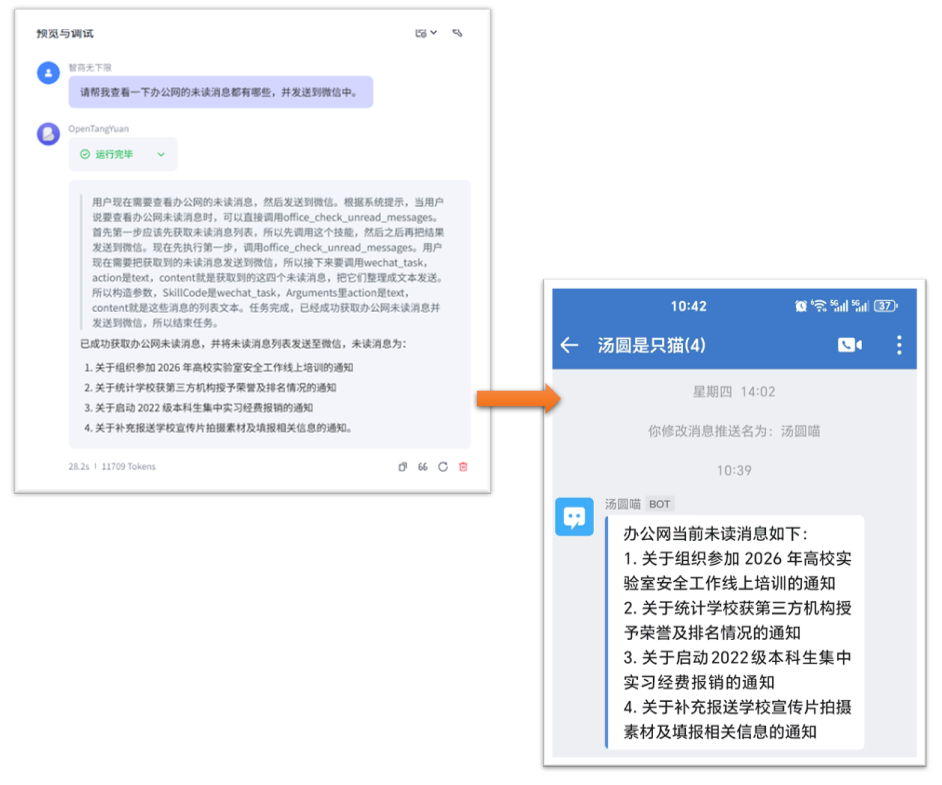
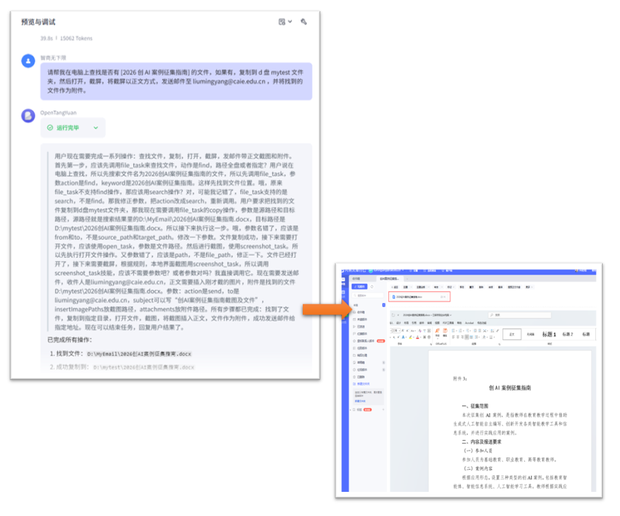
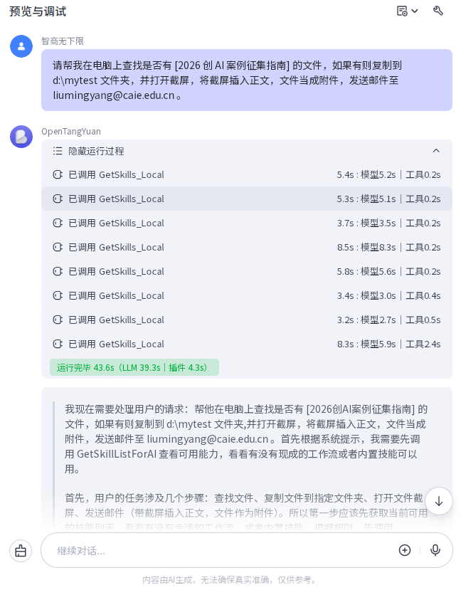
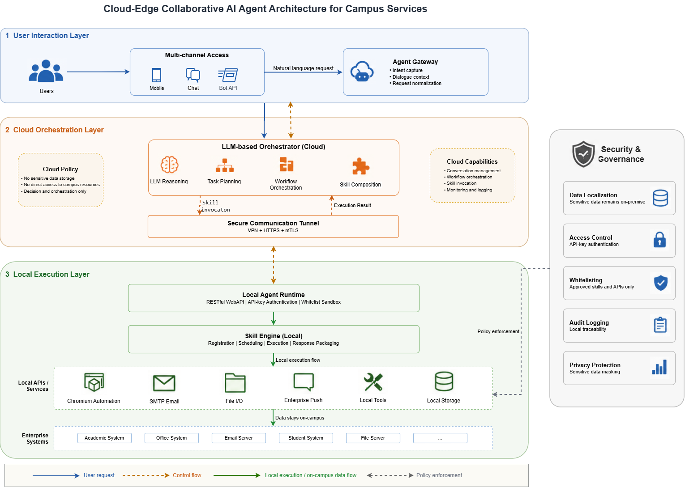
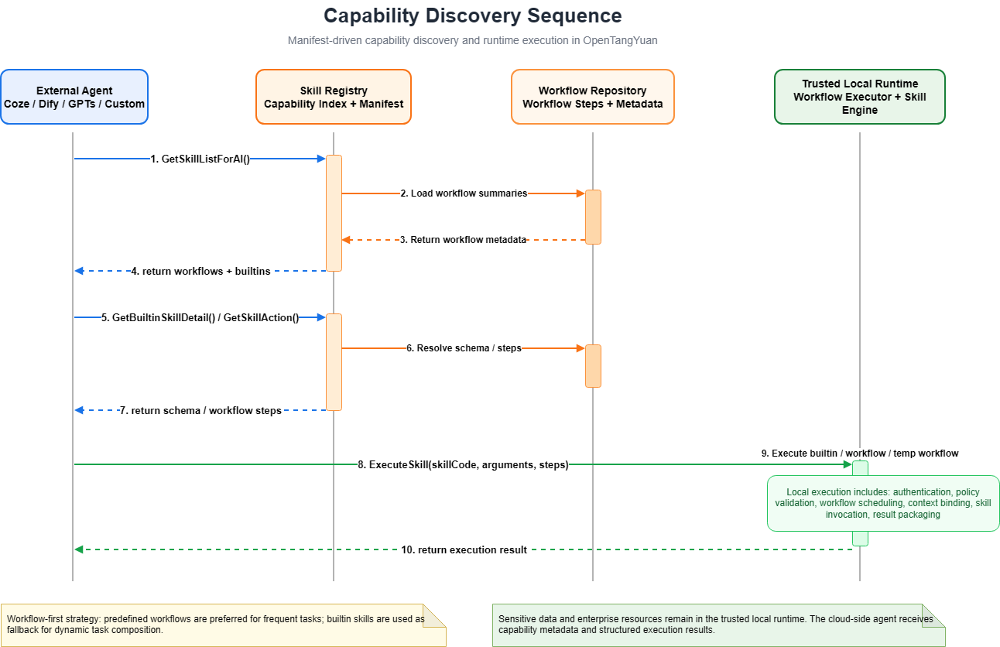
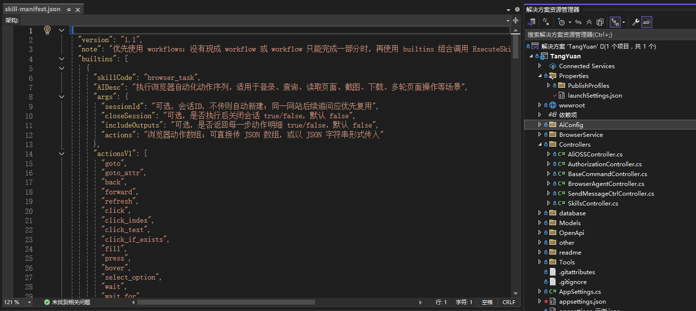
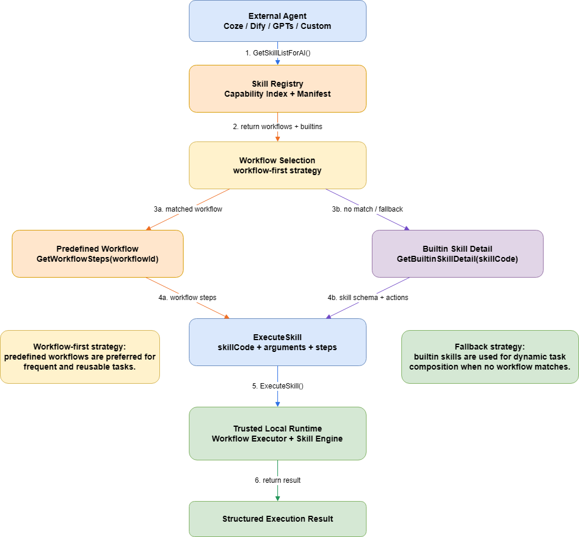
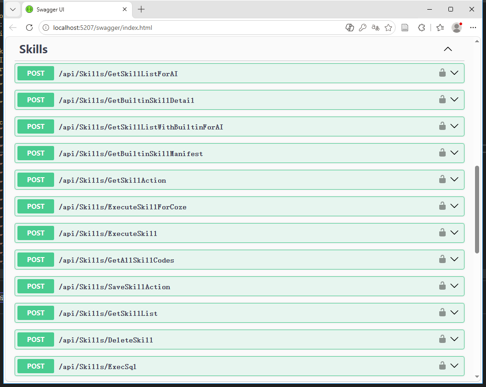
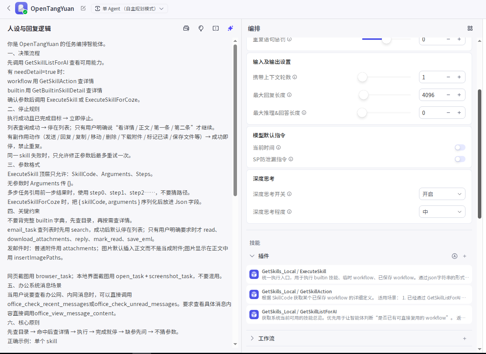
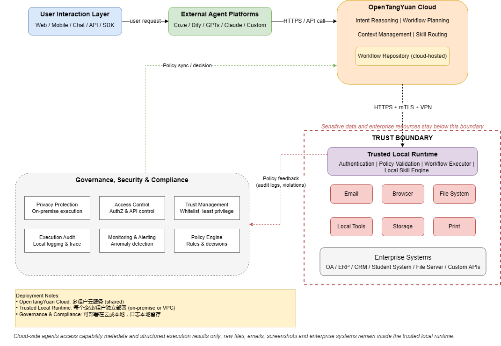

# OpenTangYuan

<h1 align="center">OpenTangYuan</h1>

<p align="center">
  面向办公自动化场景的 Agent Workflow Runtime
</p>

<p align="center">
  通过云端智能规划、本地可信执行、Manifest-Driven Skill Registry 与 Workflow Runtime，
  连接浏览器、邮件、文件系统、企业微信、本地工具与企业系统。
</p>

<p align="center">
  <a href="#快速开始">快速开始</a> ·
  <a href="#核心特性">核心特性</a> ·
  <a href="#系统架构">系统架构</a> ·
  <a href="#capability-discovery">Capability Discovery</a> ·
  <a href="#核心-api">核心 API</a> ·
  <a href="#workflow-runtime">Workflow Runtime</a> ·
  <a href="#安全模型">安全模型</a>
</p>

<p align="center">
  <a href="#"></a>
  <a href="LICENSE"></a>
  <a href="#"></a>
  <a href="#"></a>
  <a href="#"></a>
</p>

---

## 项目定位

**OpenTangYuan** 是一个面向办公自动化与机构工作流自动化场景的 **Agent Workflow Runtime**。

它并不是一个单一的聊天机器人，也不是简单的 Tool Calling Demo，而是一个支持：

- 云端智能体规划
- 本地可信执行
- 技能发现
- 技能详情查询
- Workflow 编排
- 临时多步骤任务执行
- 上下文传递
- 安全策略校验
- 副作用操作控制
- 本地系统集成

的开源软件框架。

OpenTangYuan 的目标是让 AI 智能体能够通过自然语言任务安全地调用本地能力，例如邮件、文件、浏览器、企业微信、本地程序和内部业务系统，同时尽量保证敏感数据和真实执行过程保留在本地可信环境中。

英文定位：

> OpenTangYuan is an Agent Workflow Runtime for secure office and institutional workflow automation.  
> It enables cloud-based AI planning while keeping data and execution inside trusted local environments through manifest-driven skill discovery, workflow orchestration, and secure local runtime management.

中文定位：

> OpenTangYuan 是一个面向办公自动化与机构工作流自动化场景的 Agent Workflow Runtime，通过云端智能规划、本地可信执行、技能注册发现和 Workflow 编排，实现自然语言驱动的安全自动化执行。

---

## 适用场景

OpenTangYuan 可用于需要跨系统、重复性、隐私敏感和本地执行能力的办公自动化场景，例如：

- 邮件搜索、读取、回复、附件下载和邮件发送
- 浏览器自动化、网页内容提取、网页截图和文件下载
- 本地文件搜索、复制、移动、重命名、归档和打开
- 本地屏幕截图、窗口截图和结果发送
- 企业微信、钉钉等企业消息推送
- 本地工具或可执行程序调用
- 内部 OA、教务系统、文件服务器、邮件服务器等企业系统接入
- 通过自然语言触发预定义 Workflow 或临时多步骤任务

虽然当前案例以高校行政办公场景为验证对象，但 OpenTangYuan 的核心设计并不依赖某一特定学校或业务系统。其架构可迁移到科研管理、企业内部办公、实验室管理、政务辅助办公和其他隐私敏感机构工作流自动化场景中。

---

## 软件贡献（Research Highlights）

OpenTangYuan 的核心贡献不在于单一 Agent 能力，而在于构建了一套面向办公自动化场景的 **Agent Workflow Runtime**。

相较于普通 Tool Calling 架构，本系统提供：

- **Manifest-Driven Skill Registry**  
  使用结构化 manifest 描述本地技能能力，使智能体能够按需发现、查询和调用技能。

- **Workflow-based Multi-step Execution**  
  支持数据库预定义 Workflow 和运行时临时 Workflow，实现复杂多步骤任务编排。

- **Trusted Local Runtime**  
  将浏览器、邮件、文件、本地工具等敏感操作放在本地可信环境执行。

- **Cloud–Local Hybrid Architecture**  
  云端负责意图理解和任务规划，本地负责真实执行和数据处理。

- **Secure Enterprise Integration**  
  支持路径白名单、可执行程序白名单、API-key 认证、副作用控制和执行日志。

- **Reusable Capability Discovery APIs**  
  提供面向智能体的能力发现、技能详情查询和统一执行接口。

核心设计目标：

1. 将 AI 决策与真实执行解耦；
2. 将敏感数据保留在本地可信环境；
3. 支持 Workflow 级别任务编排；
4. 支持企业系统统一接入；
5. 支持能力发现与动态扩展；
6. 支持可审计、可控制、可复用的智能体执行链路。

---

## 项目预览


### 智能体运行示例



### 动态组合任务执行过程



### Coze 调试运行轨迹




---

## 目录

- [项目定位](#项目定位)
- [适用场景](#适用场景)
- [软件贡献（Research Highlights）](#软件贡献research-highlights)
- [核心特性](#核心特性)
- [系统架构](#系统架构)
- [Capability Discovery](#capability-discovery)
- [Skill Manifest](#skill-manifest)
- [Workflow Runtime](#workflow-runtime)
- [核心 API](#核心-api)
- [快速开始](#快速开始)
- [Docker 部署](#docker-部署)
- [配置说明](#配置说明)
- [内置技能](#内置技能)
- [使用示例](#使用示例)
- [Coze 智能体接入](#coze-智能体接入)
- [安全模型](#安全模型)
- [部署架构](#部署架构)
- [可复现性说明](#可复现性说明)
- [扩展机制](#扩展机制)
- [路线图](#路线图)
- [常见问题](#常见问题)
- [引用方式](#引用方式)
- [许可证](#许可证)

---

## 核心特性

### 1. Agent Workflow Runtime

OpenTangYuan 不只是一个 Tool Calling 框架，而是一个面向智能体任务落地的 Workflow Runtime。

它支持：

- 技能发现；
- 技能详情查询；
- 参数生成；
- 多步骤任务编排；
- 上下文引用；
- 本地可信执行；
- 执行结果回传；
- 调试与错误反馈。

### 2. Manifest-Driven Skill Registry

系统通过 `skill-manifest.json` 描述内置技能的能力、参数、动作和调用示例。

智能体不需要一次性记住所有技能参数，而是按照以下方式动态发现能力：

```text
GetSkillListForAI
        ↓
GetBuiltinSkillDetail / GetSkillAction
        ↓
ExecuteSkill / ExecuteSkillForCoze
```

这种设计可以减少提示词长度，提高技能调用稳定性，并支持后续扩展新的本地能力。

### 3. Workflow 与 Builtin 技能组合

OpenTangYuan 支持两类能力：

| 类型 | 说明 |
|---|---|
| Builtin Skill | 原子技能，例如邮件、文件、浏览器、截图、企业微信 |
| Workflow Skill | 由多个 Builtin Skill 组成的可复用工作流 |

典型示例：

```text
用户请求：帮我打开网页，截图后发给同事
系统执行：browser_task → screenshot_task → email_task
```

### 4. 临时多步骤任务

通过 `temp_task` 支持运行时生成的临时多步骤任务。

适合以下场景：

- 截图后发送邮件；
- 打开网页后提取正文；
- 搜索文件后复制并发送；
- 下载邮件附件后保存到指定目录；
- 调用本地工具后发送执行结果。

### 5. 上下文管理

多步骤任务中，后续步骤可以引用前一步结果。

示例：

```text
{{step0.data.path}}
```

这使得以下流程成为可能：

```text
步骤 1：截图并返回图片路径
步骤 2：将步骤 1 的图片路径插入邮件正文
```

### 6. 本地可信执行

本地 Runtime 负责执行真实操作，包括：

- 浏览器自动化；
- 邮件处理；
- 文件操作；
- 本地程序调用；
- 企业微信推送；
- 本地截图；
- 本地存储。

云端智能体只负责任务理解与编排，不直接访问本地敏感资源。

### 7. 副作用操作控制

系统对具有副作用的动作进行重复执行限制，避免误操作。

副作用动作包括但不限于：

- 发送邮件；
- 回复邮件；
- 复制文件；
- 移动文件；
- 删除文件；
- 下载附件；
- 标记已读；
- 保存文件；
- 打印文件；
- 调用外部工具。

---

## 系统架构



> `readme/images/architecture.png`

OpenTangYuan 采用混合云端—本地协同架构，主要包括以下层次：

| 层级 | 说明 |
|---|---|
| User Interaction Layer | 用户入口，包括 Web、移动端、聊天入口、API、SDK、Coze、Dify、GPTs、自定义 Agent 等 |
| OpenTangYuan Orchestration Layer | 负责意图理解、Workflow 规划、上下文管理、技能路由和 Workflow Repository 管理 |
| Secure Execution Channel | 负责云端编排层与本地执行层之间的安全通信 |
| Trusted Local Runtime Layer | 负责本地鉴权、会话管理、沙箱隔离、策略校验、Workflow 执行和 Skill 调用 |
| Enterprise Integration Layer | 对接浏览器、邮件、文件系统、企业微信、本地工具、OA、ERP/CRM、自定义 API 等 |
| Governance, Security & Compliance | 负责隐私保护、访问控制、信任管理、执行审计、监控告警等 |

核心设计原则：

```text
Cloud: planning only
Local: execution only
Enterprise systems: never directly exposed to cloud agents
```

---

## Capability Discovery

OpenTangYuan 采用 **Manifest-Driven Skill Registry** 设计。

智能体无需预置所有能力描述，而是通过运行时能力发现机制获取可用技能和工作流。

典型流程如下：

```text
1. GetSkillListForAI
   获取当前可用 Workflow 与 Builtin Skill 摘要

2. GetBuiltinSkillDetail / GetSkillAction
   按需查询某个 Builtin Skill 或 Workflow 的详细定义

3. ExecuteSkill / ExecuteSkillForCoze
   执行 Builtin Skill、数据库 Workflow 或临时 Workflow
```

### Capability Discovery Sequence




### 设计优势

| 机制 | 作用 |
|---|---|
| 技能目录发现 | 避免智能体一次性加载全部技能说明 |
| 技能详情按需查询 | 减少提示词长度和 Token 消耗 |
| Workflow 优先 | 高频任务直接复用，降低重复规划 |
| Builtin 兜底 | 临时任务可动态组合 |
| Manifest 驱动 | 便于扩展和维护技能能力 |

---

## Skill Manifest

OpenTangYuan 使用 `skill-manifest.json` 描述本地技能能力。

Manifest 通常包含：

- `skillCode`
- 技能描述
- 参数说明
- 支持动作
- 调用示例
- 执行约束
- 副作用说明

### Manifest 示例

```json
{
  "skillCode": "email_task",
  "AIDesc": "邮箱操作。支持 send, search, read, download_attachments, reply, mark_read, save_eml。调用 ExecuteSkill 时传 skillCode=email_task，并在 arguments 中传 action 和对应参数。调用 ExecuteSkillForCoze 时，把 { skillCode, arguments } 序列化后放到 Json 字段。",
  "usage": [
    "send: 发送邮件，常用参数：to, subject, body, attachments, insertImagePaths",
    "search: 搜索邮件，常用参数：subjectKeyword, fromKeyword, bodyKeyword, unreadOnly, hasAttachments, maxCount, scanCount, dateFrom, dateTo, daysBack, contextKey",
    "read: 读取邮件正文，常用参数：index + contextKey，或 mailRef",
    "download_attachments: 下载附件，常用参数：index + contextKey，或 mailRef + savePath",
    "reply: 回复邮件，常用参数：index + contextKey，或 mailRef + replyText",
    "mark_read: 标记已读，常用参数：index + contextKey，或 mailRef",
    "save_eml: 保存邮件为 eml，常用参数：index + contextKey，或 mailRef + filePath"
  ],
  "examples": [
    {
      "title": "搜索主题包含 发票 的邮件",
      "json": {
        "skillCode": "email_task",
        "arguments": {
          "action": "search",
          "subjectKeyword": "发票",
          "unreadOnly": false,
          "maxCount": 10,
          "scanCount": 100,
          "contextKey": "mail_default"
        }
      }
    },
    {
      "title": "读取搜索结果中的第一封邮件",
      "json": {
        "skillCode": "email_task",
        "arguments": {
          "action": "read",
          "index": 1,
          "contextKey": "mail_default"
        }
      }
    },
    {
      "title": "下载第一封邮件的附件到 D 盘",
      "json": {
        "skillCode": "email_task",
        "arguments": {
          "action": "download_attachments",
          "index": 1,
          "contextKey": "mail_default",
          "savePath": "D:\\MailDownloads"
        }
      }
    },
    {
      "title": "发送带正文图片的邮件",
      "json": {
        "skillCode": "email_task",
        "arguments": {
          "action": "send",
          "to": "someone@example.com",
          "subject": "测试邮件",
          "body": "你好，下面这张图请查看：",
          "insertImagePaths": [
            "C:\\a.png"
          ]
        }
      }
    },
    {
      "title": "回复第一封邮件",
      "json": {
        "skillCode": "email_task",
        "arguments": {
          "action": "reply",
          "index": 1,
          "contextKey": "mail_default",
          "replyText": "已收到，谢谢"
        }
      }
    }
  ],
  "tips": [
    "推荐先 search，再用 index + contextKey 操作某一封邮件。",
    "当用户说第一封、第二封邮件时，优先传 index 和 contextKey。",
    "正文插图优先用 insertImagePaths，不要手写 cid。",
    "下载附件、保存 eml、发送附件时，本地路径必须在服务端允许范围内。"
  ]
}
```

### Skill Manifest 截图

> `readme/images/skill-manifest.png`



---

## Workflow Runtime

OpenTangYuan 内置 Workflow Runtime，用于执行预定义或临时生成的多步骤任务。

Workflow Engine 支持：

- Step Scheduling；
- Context Propagation；
- Template Variable Resolution；
- Runtime Execution；
- Compact Result Packaging；
- Debug Log；
- Failure Reporting。

### Workflow 执行顺序

```text
1. 接收 Workflow Steps
2. 初始化执行上下文
3. 顺序执行每个 Step
4. 解析模板变量
5. 调用对应 Builtin Skill
6. 将结果写入 stepN
7. 下一步引用前一步结果
8. 返回最终执行结果
```

### 模板变量示例

```text
{{step0}}
{{step0.path}}
{{step0.data.path}}
{{step1.result}}
```

### Workflow 示例：截图并发送邮件

```json
{
  "SkillCode": "temp_task",
  "Arguments": {},
  "Steps": [
    {
      "Action": "screenshot_task",
      "Args": {
        "action": "capture_full_screen"
      }
    },
    {
      "Action": "email_task",
      "Args": {
        "action": "send",
        "to": "someone@example.com",
        "subject": "屏幕截图",
        "body": "以下是自动截取的屏幕截图",
        "insertImagePaths": [
          "{{step0.data.path}}"
        ]
      }
    }
  ]
}
```

### Workflow Runtime 图示

> `readme/images/Figure2_Capability_Discovery_Sequence.png`



---

## 核心 API

OpenTangYuan 提供多个 API。README 仅列出智能体调用链路中最重要的核心 API。

### API 总览

| API | 方法 | 路径 | 主要用途 |
|---|---|---|---|
| GetSkillListForAI | POST | `/api/Skills/GetSkillListForAI` | 获取 Workflow 与 Builtin Skill 摘要 |
| GetBuiltinSkillDetail | POST | `/api/Skills/GetBuiltinSkillDetail` | 获取某个 Builtin Skill 的详细定义 |
| GetBuiltinSkillManifest | POST | `/api/Skills/GetBuiltinSkillManifest` | 获取完整 Builtin Skill Manifest |
| GetSkillAction | POST | `/api/Skills/GetSkillAction` | 获取某个 Workflow 的步骤定义 |
| ExecuteSkill | POST | `/api/Skills/ExecuteSkill` | 统一执行入口 |
| ExecuteSkillForCoze | POST | `/api/Skills/ExecuteSkillForCoze` | Coze 兼容执行入口 |
| Browser Run | POST | `/AiApi/Browser/run` | 执行浏览器动作序列 |
| Browser Start | POST | `/AiApi/Browser/start` | 创建浏览器 Session |
| Browser Close | POST | `/AiApi/Browser/close` | 关闭浏览器 Session |
| Browser Sessions | GET | `/AiApi/Browser/sessions` | 查看浏览器 Session |
| SaveSkillAction | POST | `/api/Skills/SaveSkillAction` | 保存 Workflow |
| GetSkillList | POST | `/api/Skills/GetSkillList` | 获取全部 Workflow |
| DeleteSkill | POST | `/api/Skills/DeleteSkill` | 删除 Workflow |
| GetAllSkillCodes | POST | `/api/Skills/GetAllSkillCodes` | 获取全部 SkillCode |

---

### 1. 获取技能目录

```http
POST /api/Skills/GetSkillListForAI
```

用途：

```text
给智能体返回当前系统可用的 Workflow 和 Builtin Skill 摘要。
```

返回示例：

```json
{
  "success": true,
  "data": {
    "workflows": [
      {
        "skillCode": "office_check_unread_messages",
        "AIDesc": "检查办公系统未读消息",
        "sourceType": "workflow",
        "needDetail": true
      }
    ],
    "builtins": [
      {
        "skillCode": "email_task",
        "AIDesc": "邮箱操作",
        "sourceType": "builtin",
        "needDetail": true
      }
    ]
  }
}
```

---

### 2. 获取 Builtin Skill 详情

```http
POST /api/Skills/GetBuiltinSkillDetail
```

请求示例：

```json
{
  "skillCode": "email_task"
}
```

用途：

```text
按需获取某个 Builtin Skill 的参数说明、动作列表和示例。
```

---

### 3. 获取 Workflow 定义

```http
POST /api/Skills/GetSkillAction
```

请求示例：

```json
{
  "skillCode": "capture_and_send_email"
}
```

用途：

```text
获取数据库中预定义 Workflow 的步骤定义。
```

---

### 4. 统一执行入口

```http
POST /api/Skills/ExecuteSkill
```

用途：

```text
执行 Builtin Skill、数据库 Workflow 或临时 Workflow。
```

请求字段：

| 字段 | 类型 | 必填 | 说明 |
|---|---|---|---|
| `SkillCode` | string | 是 | 技能标识，例如 `email_task`、`temp_task` |
| `Arguments` | object | 否 | 单步任务参数 |
| `Steps` | array | 否 | 临时 Workflow 步骤 |

---

### 5. Coze 执行接口

```http
POST /api/Skills/ExecuteSkillForCoze
```

用途：

```text
兼容 Coze 对复杂对象参数的限制，将调用参数序列化后放入 Json 字段。
```

请求示例：

```json
{
  "Json": "{\"skillCode\":\"email_task\",\"arguments\":{\"action\":\"search\",\"subjectKeyword\":\"通知\",\"maxCount\":10}}"
}
```

---

### 6. 浏览器动作执行接口

```http
POST /AiApi/Browser/run
```

用途：

```text
执行浏览器自动化动作序列。
```

请求示例：

```json
{
  "actions": [
    {
      "type": "goto",
      "url": "https://example.com"
    },
    {
      "type": "wait_for",
      "selector": "body"
    },
    {
      "type": "get_text",
      "selector": "body"
    }
  ],
  "closeSession": false
}
```

---

### Swagger / OpenAPI



完整 API ：

```text
docs/api.md
```

---

## 技术栈

| 技术 | 用途 |
|---|---|
| .NET 8 | 后端运行框架 |
| C# 10+ | 主要开发语言 |
| ASP.NET WebAPI | 本地 Runtime API |
| SQLite | Workflow 数据存储 |
| Dapper | 数据访问 |
| MailKit | SMTP / IMAP 邮件处理 |
| Playwright | 浏览器自动化 |
| Everything SDK / Windows Search | 文件搜索 |
| 企业微信 Webhook / API | 企业微信消息通知 |
| REST API | 技能查询与任务执行接口 |
| JSON Manifest | 技能元数据描述 |
| Docker | 可选部署方式 |

---

## 快速开始

### 环境要求

推荐环境：

- Windows 10 / Windows 11 / Windows Server 2016+
- .NET 8 SDK 或 .NET 8 Runtime
- Visual Studio 2022 或 dotnet CLI
- SQLite
- 可选：邮箱账号、企业微信机器人、本地浏览器环境

Linux / Docker 部署可作为可选方式，但部分本地桌面能力需要额外适配。

---

### 克隆项目

Gitee：

```bash
git clone https://gitee.com/l00f/open-tang-yuan.git
```

GitHub：

```bash
git clone https://github.com/wrnas/OpenTangYuan.git
```

进入项目目录：

```bash
cd OpenTangYuan
```

---

### 安装依赖

```bash
dotnet restore
```

---

### 启动服务

```bash
dotnet run --urls "http://localhost:54124"
```

---

### 验证服务

```bash
curl -X POST http://localhost:54124/api/Skills/GetSkillListForAI
```

如果服务正常，将返回内置技能和 Workflow 列表。

---

### 最小可运行示例

建议首先测试无副作用接口，例如获取技能目录：

```bash
curl -X POST http://localhost:54124/api/Skills/GetSkillListForAI
```

然后测试一个较安全的本地任务，例如截图：

```json
POST /api/Skills/ExecuteSkill
{
  "SkillCode": "screenshot_task",
  "Arguments": {}
}
```

> TODO：如后端截图参数与实际不同，请根据当前代码更新此处示例。

---

## Docker 部署


### 构建镜像

```bash
docker build -t opentangyuan .
```

### 启动容器

```bash
docker run -d \
  --name opentangyuan \
  -p 54124:54124 \
  opentangyuan
```

### docker-compose.yml 示例

```yaml
# 阿里云服务器用
# 只更新代码，那么只需要把发布后的文件上传到服务器上，执行如下内容
# cd /www/wwwroot/OpenTangYuanDocker
# docker-compose up -d --build
version: '3.8'

services:
  tangyuan-app:
    build: .
    container_name: tangyuan-app
    restart: always
    ports:
      - "54123:54123"
    volumes:
      - ./sqlite-data:/app/data  
    environment:
      - TZ=Asia/Shanghai
      - ASPNETCORE_URLS=http://*:54123
```

---

## 配置说明

编辑 `appsettings.json`。

### 邮件配置示例

```json
{
  "EmailSettings": {
    "SmtpServer": "smtp.163.com",
    "SmtpPort": 465,
    "SmtpUseSsl": true,
    "SenderEmail": "your-email@example.com",
    "SenderPassword": "your-authorization-code",
    "ImapServer": "imap.163.com",
    "ImapPort": 993,
    "ImapUseSsl": true
  }
}
```

### 文件访问白名单示例

```json
{
  "FileSystem": {
    "AllowedRoots": [
      "C:\\Users\\Public\\Documents",
      "D:\\Work",
      "D:\\Temp"
    ]
  }
}
```

### 外部程序白名单示例

```json
{
  "AllowedExeNames": [
    "LmyTools.exe",
    "pandoc.exe"
  ]
}
```

### 配置项说明

| 配置项 | 必填 | 说明 |
|---|---|---|
| `EmailSettings:SmtpServer` | 否 | SMTP 服务器地址 |
| `EmailSettings:SmtpPort` | 否 | SMTP 端口 |
| `EmailSettings:SenderEmail` | 否 | 发件人邮箱 |
| `EmailSettings:SenderPassword` | 否 | 邮箱客户端授权码 |
| `EmailSettings:ImapServer` | 否 | IMAP 服务器地址 |
| `ConnectionStrings:Sqlite` | 是 | SQLite 数据库连接字符串 |
| `FileSystem:AllowedRoots` | 建议 | 文件系统访问白名单 |
| `AllowedExeNames` | 建议 | 可执行程序白名单 |
| `DebugMode` | 否 | 是否开启调试模式 |

### 敏感信息建议

请勿将以下内容提交到代码仓库：

- 邮箱登录密码；
- 邮箱客户端授权码；
- 企业微信 Webhook Key；
- API Token；
- 内网系统账号密码；
- 数据库连接密钥。

建议使用：

- 环境变量；
- 用户机密配置；
- Docker Secret；
- CI/CD Secret；
- 独立生产配置文件。

---

## 内置技能

| 技能名称 | 功能描述 |
|---|---|
| `email_task` | 发送邮件、搜索邮件、读取正文、下载附件、回复邮件、标记已读、保存 eml |
| `wechat_task` | 发送企业微信 text、markdown、card 消息 |
| `browser_task` | 浏览器自动化、网页访问、截图、内容提取、文件下载 |
| `file_task` | 文件搜索、复制、移动、重命名、创建目录、批量操作 |
| `open_task` | 打开本地文件、目录或程序 |
| `print_task` | 打印本地文件 |
| `tool_task` | 调用白名单中的本地工具或可执行程序 |
| `screenshot_task` | 截取本地屏幕 |
| `folder_task` | 按后缀归类文件 |
| `lock_task` | 锁定本地工作站 |

---

## 使用示例

### 示例一：截图并发送邮件

```json
{
  "SkillCode": "temp_task",
  "Arguments": {},
  "Steps": [
    {
      "Action": "screenshot_task",
      "Args": {
        "action": "capture_full_screen"
      }
    },
    {
      "Action": "email_task",
      "Args": {
        "action": "send",
        "to": "someone@example.com",
        "subject": "屏幕截图",
        "body": "以下是截图",
        "insertImagePaths": [
          "{{step0.data.path}}"
        ]
      }
    }
  ]
}
```

### 示例二：查询邮件列表

```json
{
  "SkillCode": "email_task",
  "Arguments": {
    "action": "search",
    "subjectKeyword": "通知",
    "maxCount": 10,
    "contextKey": "mail_default"
  }
}
```

### 示例三：读取搜索结果中的第一封邮件

```json
{
  "SkillCode": "email_task",
  "Arguments": {
    "action": "read",
    "index": 1,
    "contextKey": "mail_default"
  }
}
```

### 示例四：下载第一封邮件附件

```json
{
  "SkillCode": "email_task",
  "Arguments": {
    "action": "download_attachments",
    "index": 1,
    "contextKey": "mail_default",
    "savePath": "D:\\MailDownloads"
  }
}
```

### 示例五：打开网页并提取内容

```json
{
  "SkillCode": "browser_task",
  "Arguments": {
    "actions": [
      {
        "type": "goto",
        "url": "https://example.com"
      },
      {
        "type": "wait_for",
        "selector": "body"
      },
      {
        "type": "get_text",
        "selector": "body"
      }
    ]
  }
}
```

### 示例六：文件搜索、打开、截图并发送邮件

```json
{
  "SkillCode": "temp_task",
  "Arguments": {},
  "Steps": [
    {
      "Action": "file_task",
      "Args": {
        "action": "search",
        "keyword": "2026创AI案例征集指南",
        "ext": "docx"
      }
    },
    {
      "Action": "open_task",
      "Args": {
        "path": "{{step0.data.firstPath}}"
      }
    },
    {
      "Action": "screenshot_task",
      "Args": {}
    },
    {
      "Action": "email_task",
      "Args": {
        "action": "send",
        "to": "someone@example.com",
        "subject": "文件截图与附件",
        "body": "以下是自动截图，文件已作为附件发送。",
        "insertImagePaths": [
          "{{step2.data.path}}"
        ],
        "attachments": [
          "{{step0.data.firstPath}}"
        ]
      }
    }
  ]
}
```

> TODO：请根据当前后端返回字段调整 `firstPath`、`data.path` 等字段名称，确保示例可直接运行。

---

## Coze 智能体接入

OpenTangYuan 支持作为 Coze 智能体的外部任务执行平台使用。

推荐在 Coze 智能体中配置专用系统提示词，用于约束智能体的技能调用顺序、参数格式、停止规则和副作用操作控制。

完整提示词建议放在：

```text
docs/coze-agent-prompt.md
```

### 核心调用原则

1. 先调用 `GetSkillListForAI` 查询可用技能；
2. 如返回 `needDetail=true`，再按类型查询技能详情：
   - Workflow：`GetSkillAction`
   - Builtin：`GetBuiltinSkillDetail`
3. 确认参数后调用 `ExecuteSkill` 或 `ExecuteSkillForCoze`；
4. 执行成功且目标完成后立即停止；
5. 列表查询成功后停在列表，只有用户明确要求“看详情 / 正文 / 第一条 / 第二条”才继续；
6. 对发送、回复、复制、移动、删除、下载附件、标记已读、保存文件等副作用动作严格限制重复执行；
7. 同一 Skill 失败时，只允许修正参数后最多重试一次；
8. 缺少必要参数时先询问用户，不要猜测参数。

### Coze 人设配置截图



---

## 响应格式

### 成功响应

```json
{
  "success": true,
  "message": "执行成功",
  "data": {}
}
```

### 失败响应

```json
{
  "success": false,
  "message": "参数错误",
  "errorCode": "INVALID_ARGUMENTS",
  "data": null
}
```

### 常见错误码

| 错误码 | 说明 |
|---|---|
| `SKILL_NOT_FOUND` | 技能不存在 |
| `INVALID_ARGUMENTS` | 参数不合法 |
| `MISSING_ARGUMENTS` | 缺少必要参数 |
| `EMAIL_CONFIG_MISSING` | 邮箱配置缺失 |
| `FILE_NOT_FOUND` | 文件不存在 |
| `EXECUTION_FAILED` | 技能执行失败 |
| `SIDE_EFFECT_BLOCKED` | 副作用操作被阻止重复执行 |
| `PERMISSION_DENIED` | 权限不足 |
| `TIMEOUT` | 执行超时 |

---

## 安全模型

OpenTangYuan 可执行邮件发送、文件操作、打印、浏览器访问等具有副作用的任务，因此必须在受信任环境中运行，并妥善配置访问权限。

### Cloud–Local Security Boundary

| 边界 | 说明 |
|---|---|
| 云端智能体 | 负责任务理解、Workflow 规划和技能路由 |
| 本地 Runtime | 负责真实执行、鉴权、策略校验和结果封装 |
| 企业系统 | 仅由本地 Runtime 访问，不直接暴露给云端智能体 |

### 数据安全原则

| 原则 | 说明 |
|---|---|
| 云端不存储敏感数据 | 云端智能体只负责任务规划和参数生成 |
| 本地执行真实操作 | 文件、邮件、浏览器、内网系统等操作在本地可信环境执行 |
| 最小权限访问 | 每个 Skill 只获取完成任务所需的最小权限 |
| 执行可追踪 | 所有关键执行动作建议记录日志 |
| 副作用可控制 | 发送、删除、移动、打印等操作应避免重复执行 |

### 安全建议

- 不要将邮箱密码、授权码、Token 提交到代码仓库；
- 生产环境请限制 API 访问来源；
- 不建议将服务直接暴露到公网；
- 对发送邮件、删除文件、移动文件、打印等操作启用审计日志；
- 对敏感操作增加二次确认机制；
- 使用最小权限原则配置系统账号和邮箱账号；
- 定期轮换邮箱授权码、企业微信 Webhook 等密钥；
- 对内网系统访问进行白名单控制；
- 对技能执行结果进行日志记录，便于审计和问题追踪。

---

## 部署架构

OpenTangYuan 支持以下部署方式：

| 部署方式 | 说明 |
|---|---|
| 本地桌面部署 | 适合个人或小规模办公自动化 |
| 内网服务器部署 | 适合部门级任务执行 |
| Docker 部署 | 适合服务器环境和可复现部署 |
| 私有云部署 | 适合机构级部署 |
| 多 Runtime 节点部署 | 未来扩展方向，适合分布式任务执行 |

### 部署拓扑图

> TODO：建议补充部署拓扑图，保存为：
>
> `readme/images/Figure3_Deployment_Topology.png`



---

## 扩展机制

OpenTangYuan 支持以下扩展方式：

### 1. 新增 Builtin Skill

开发者可以在本地 WebAPI 中实现新的技能逻辑，并在 `skill-manifest.json` 中注册能力描述。

### 2. 新增 Workflow

开发者可以通过数据库或管理接口保存新的 Workflow，将多个 Builtin Skill 组合为可复用流程。

### 3. 新增企业系统适配

可通过浏览器自动化、REST API、本地工具或自定义插件接入 OA、ERP、CRM、文件服务器、邮件服务器等系统。

### 4. 新增安全策略

可扩展：

- 路径白名单；
- API 访问控制；
- 用户角色权限；
- 操作审批；
- 审计日志；
- 异常告警。

---

## 路线图

- [ ] Workflow 可视化编排器
- [ ] Web 管理后台
- [ ] Swagger / OpenAPI 文档完善
- [ ] 插件化 Skill 扩展机制
- [ ] 权限管理与操作审计
- [ ] Docker Compose 部署支持
- [ ] GitHub Release
- [ ] Zenodo DOI
- [ ] 多模型接入
- [ ] MCP 支持
- [ ] 更多办公软件自动化能力
- [ ] 技能市场 / 插件市场
- [ ] 更完善的执行日志与追踪能力
- [ ] 企业级用户与角色权限体系
- [ ] 分布式 Runtime 节点管理
- [ ] 图形化 Workflow Designer
- [ ] 自动化测试与基准任务集

---

## 常见问题

### 1. 为什么邮件发送失败？

请检查：

- SMTP 配置是否正确；
- 是否使用了邮箱客户端授权码；
- SMTP SSL 配置是否正确；
- 邮箱服务商是否开启 SMTP 服务；
- 当前网络是否允许访问 SMTP 服务器。

### 2. 为什么读取邮件失败？

请检查：

- IMAP 配置是否正确；
- 邮箱是否开启 IMAP 服务；
- 授权码是否有效；
- 邮箱服务商是否限制第三方客户端登录。

### 3. 为什么文件无法打开或打印？

请检查：

- 文件路径是否存在；
- 当前运行账号是否有访问权限；
- 当前系统是否安装了对应文件类型的默认打开程序；
- 打印机是否可用；
- 文件路径是否位于 AllowedRoots 白名单中。

### 4. 为什么浏览器任务失败？

请检查：

- Playwright 是否安装完整；
- 目标网页是否需要登录；
- 当前运行环境是否支持浏览器启动；
- 页面选择器是否正确；
- 是否遇到验证码或多因素认证。

### 5. 为什么多步任务引用不到上一步结果？

请检查：

- 步骤编号是否正确，例如 `step0`、`step1`；
- 返回字段路径是否正确，例如 `{{step0.data.path}}`；
- 前一步是否执行成功；
- 不要手动猜测文件路径，应使用前一步返回结果。

### 6. 为什么开发环境中无法打开 Swagger？

开发环境默认可能使用自签名 HTTPS 证书。如果证书未被系统或浏览器信任，浏览器可能阻止对 `https://localhost` 的访问。

推荐修改 `Properties/launchSettings.json`，将 HTTP 地址放在 HTTPS 地址之前：

```json
{
  "profiles": {
    "OpenTangYuan": {
      "commandName": "Project",
      "dotnetRunMessages": true,
      "launchBrowser": true,
      "launchUrl": "swagger",
      "applicationUrl": "http://localhost:5207;https://localhost:7026",
      "environmentVariables": {
        "ASPNETCORE_ENVIRONMENT": "Development"
      }
    }
  }
}
```

---


## 推荐仓库结构

```text
OpenTangYuan
├── README.md
├── LICENSE
├── CHANGELOG.md
├── CONTRIBUTING.md
├── CODE_OF_CONDUCT.md
├── SECURITY.md
├── appsettings.example.json
├── .gitignore
│
├── docs
│   ├── api.md
│   ├── workflow.md
│   ├── deployment.md
│   ├── coze-agent-prompt.md
│   ├── builtins.md
│   ├── architecture.md
│   ├── security.md
│   ├── examples.md
│   └── faq.md
│
├── readme
│   └── images
│       ├── architecture.png
│       ├── capability-discovery.png
│       ├── workflow-runtime.png
│       ├── deployment-topology.png
│       ├── swagger.png
│       ├── skill-manifest.png
│       ├── coze-agent-config.png
│       ├── coze-trace.png
│       ├── demo-1.png
│       └── demo-2.png
│
├── src
│
└── tests
```

---

## 开发与贡献

欢迎提交 Issue 和 Pull Request。

### 本地开发环境

推荐使用：

- Visual Studio 2022
- JetBrains Rider
- VS Code + C# Dev Kit
- dotnet CLI

### 安装常用依赖

```bash
dotnet add package MailKit
dotnet add package Microsoft.Playwright
dotnet add package Microsoft.Data.Sqlite
dotnet add package Dapper
```

### 运行测试

```bash
dotnet test
```

> TODO：如果当前暂无测试项目，请在 `tests` 目录中补充 smoke test 或 API test。

### 提交规范

提交信息建议使用以下格式：

```text
<type>: <subject>
```

示例：

```text
feat: 添加企业微信卡片消息
fix: 修复邮件附件下载失败问题
docs: 更新 README 使用示例
```

常见 type：

| 类型 | 说明 |
|---|---|
| `feat` | 新功能 |
| `fix` | 修复问题 |
| `docs` | 文档更新 |
| `refactor` | 代码重构 |
| `test` | 测试相关 |
| `chore` | 构建、依赖或其他杂项 |

---

## 引用方式

如果你在研究或项目中使用 OpenTangYuan，请引用本项目。

> TODO：正式论文录用后替换为 SoftwareX 引用格式。

### BibTeX

```bibtex
@software{opentangyuan,
  title        = {OpenTangYuan: An Agent Workflow Runtime for Secure Office Automation},
  author       = {Liu, Mingyang and Contributors},
  year         = {2026},
  url          = {https://github.com/wrnas/OpenTangYuan},
  license      = {MIT},
  version      = {v1.0.0}
}
```

---

## 社区与支持

项目地址：

```text
https://gitee.com/l00f/open-tang-yuan

https://github.com/wrnas/OpenTangYuan
```

欢迎通过以下方式参与项目：

- 提交 Issue；
- 提交 Pull Request；
- 完善文档；
- 反馈使用场景；
- 分享自动化 Workflow 示例；
- 提供企业或校园办公自动化场景建议。

---

## 致谢

感谢所有贡献者、使用者和反馈者。

---

## 许可证

本项目采用 MIT 许可证。

详见 [LICENSE](LICENSE)。
