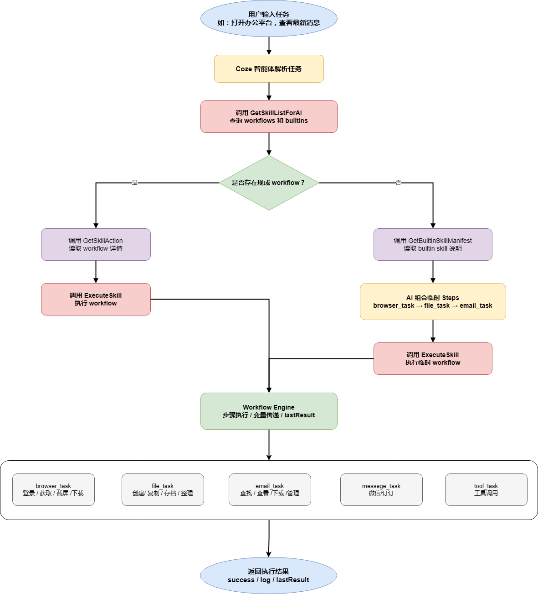
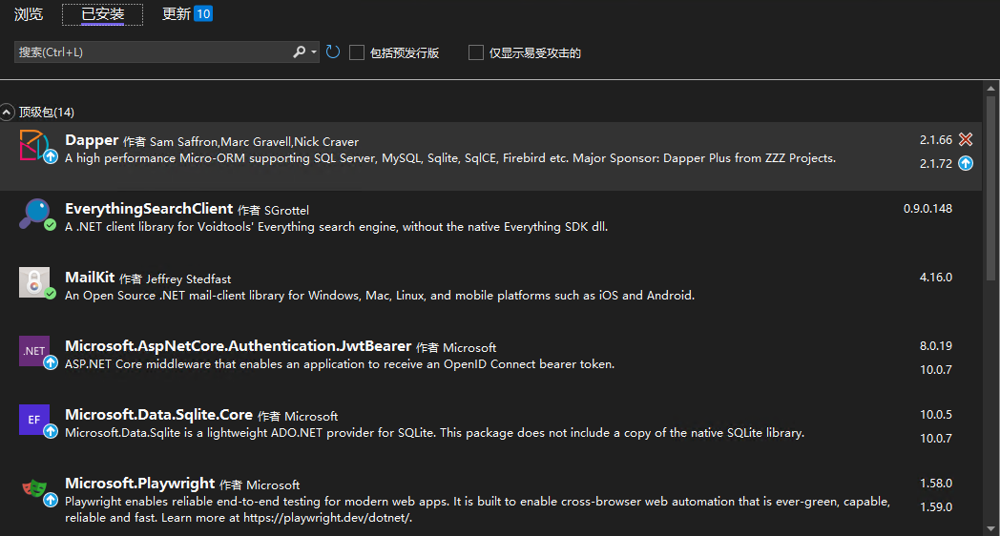
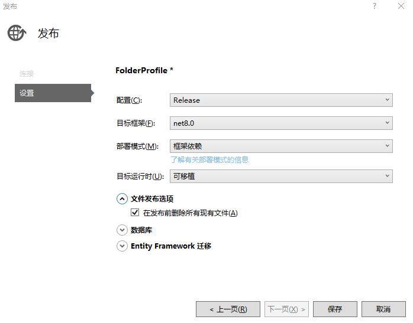

# OpenTangYuan 智能体任务编排平台

## 项目概述

**OpenTangYuan** 是一个可编排、多技能执行的智能体平台，旨在帮助用户通过自然语言指令操作办公任务、邮件、文件和网页等系统资源。  
智能体能够自动决策执行顺序、处理多步任务、复用上下文，并提供调试和重试机制。

核心特点：

- **Workflow + Builtin 技能组合**：支持自定义 workflow 和内置原子技能组合。
- **多步任务编排**：使用 `temp_task` 可以组合多步操作，如截图 + 邮件发送。
- **上下文管理**：通过 `contextKey` 和 `index` 实现多步连续操作。
- **安全与副作用控制**：对发送邮件、打印、文件操作等动作限制重复执行。
- **调试模式可视化**：可查看智能体内部决策与参数选择过程。

---

## 技术栈

- .NET 8
- C# 10+
- SQLite（存储 workflow 数据）
- MailKit（邮箱操作）
- Playwright（浏览器操作）
- Windows OS 原生命令（打开文件、打印等）
- GitHub Actions / CI 可选（部署和测试）

---
## 工作流程图
<p align="center">
  
</p>

## 目录结构
```text
/OpenTangYuan
│
├─ /AiConfig
│ └─ skill-manifest.json # 内置技能说明
│
├─ /Controllers
│ └─ SkillsController.cs # 核心 API 实现
│
├─ /Helpers
│ ├─ MailKitHelper.cs # 邮件操作封装
│ └─ CommonHelper.cs # 通用辅助方法
│
├─ /Models
│ └─ SkillModels.cs # Skill 数据模型
│
├─ /wwwroot # 静态资源（可选）
│
├─ appsettings.json # 系统配置，包括邮箱配置
└─ Program.cs / Startup.cs # 启动与服务配置
 ```


## 核心技能

### 内置技能（Builtin）

- `email_task`：发送邮件、搜索邮件、读取邮件正文、下载附件、回复邮件、标记已读、保存 eml
- `wechat_task`：发送企业微信消息（text、markdown、card）
- `browser_task`：网页操作（打开网页、截图、提取内容）
- `file_task`：文件操作（搜索、复制、移动、重命名、创建目录）
- `open_task`：打开本地文件
- `print_task`：打印文件
- `tool_task`：调用本地工具或可执行程序
- `screenshot_task`：截取本地屏幕或指定窗口

### Workflow

- 可通过 SQLite 配置，支持组合已有技能
- 可被智能体调用或临时多步任务组合使用

---

## API 概览

### 1. 获取技能目录


POST /api/Skills/GetSkillListForAI
返回：
{
  "workflows": [...],
  "builtins": [...]
}
### 2. 获取技能详情

Workflow: GetSkillAction

Builtin: GetBuiltinSkillDetail

### 2.1 辅助功能，用于swagger中调试

获取全部Workflow: GetSkillList

保存自己编排的Workflow: SaveSkillAction

删除指定的Workflow：DeleteSkill


### 3. 执行技能
POST /api/Skills/ExecuteSkill


参数示例（多步任务）：
```json
{
  "SkillCode": "temp_task",
  "Arguments": {},
  "Steps": [
    {
      "Action": "screenshot_task",
      "Args": { "action": "capture_full_screen" }
    },
    {
      "Action": "email_task",
      "Args": {
        "action": "send",
        "to": "someone@example.com",
        "subject": "屏幕截图",
        "body": "以下是截图",
        "insertImagePaths": ["{{step0.data.path}}"]
      }
    }
  ]
}
```
## 使用示例

### 1.截图并发送邮件

- .截取屏幕

- .将截图插入邮件正文发送

### 4.查询邮件列表

- email_task.search

- 使用 index 和 contextKey 操作具体邮件

### 打开或打印本地文件

- open_task：打开文件

- print_task：打印文件，支持等待完成

## 开发约束与注意事项

### 1.内置技能执行后，副作用动作（发送邮件、打印、文件操作）禁止重复执行。

### 2.ExecuteSkill 调用顶层只允许：

- SkillCode

- Arguments

- Steps

### 3. 多步任务中引用前一步结果时，使用 step0.data.path，不要猜路径。

### 4. email_task：

- 普通附件使用 attachments

- 插入正文使用 insertImagePaths

- 不要自行拼 cid

### 5. 截图：

- 网页截图用 browser_task

- 本地界面截图用 open_task + screenshot_task

### 6. 配置

appsettings.json：
```json
{
  "EmailSettings": {
    "SmtpServer": "smtp.163.com",
    "SmtpPort": 465,
    "SmtpUseSsl": true,
    "SenderEmail": "你的邮箱",
    "SenderPassword": "客户端授权码",
    "ImapServer": "imap.163.com",
    "ImapPort": 993,
    "ImapUseSsl": true
  }
}
```
### 7. 开发与调试

- 可通过 GetSkillListForAI + GetBuiltinSkillDetail 查看技能目录与详情

- 调试时可让智能体输出思考过程（debug=true）

- 生产环境建议关闭中间思考输出，只保留最终动作和结果


## 发布及运行
### 开发的硬件环境：
- cpu ： i5 ,内存： 16G ，硬盘：1T
### 最低运行的硬件环境：
- Windows环境：
- Cpu： i3 ,内存： 4G，硬盘：512M
- Linux：
- 阿里云 2核2G ，50G硬盘
### 开发该软件的操作系统：
- windows 10 专业版
### 软件开发环境/开发工具：
- VS2022
### 该软件的运行平台/操作系统：
- windows2016 server 或更高
### 软件运行支撑环境/支持软件：
- net 8 或更高版本
### 编程语言：
- C#
### 必装依赖包
<p align="left">
  
</p>

### 发布建议设置
<p align="left">
  
</p>

### 运行建议
- Windows环境直接启动.exe文件即可
- 例如：TangYuan.exe --urls "http://0.0.0.0:54124" --contentRoot "."
- Linux 建议使用Docker
- 配置参见 docker-compose.yml
- 本地修改后可以直接在服务器上停止docker 。然后覆盖文件，重新启动即可。
```text 举例：
  cd /www/wwwroot/OpenTangYuanDocker
  docker-compose up -d --build
```