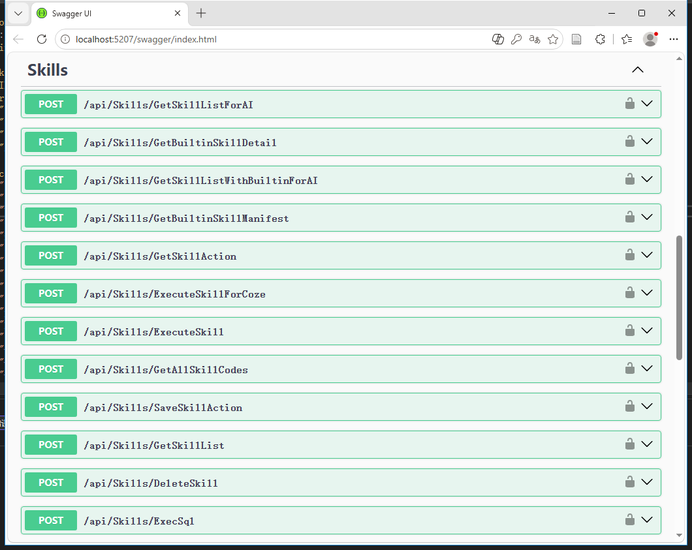
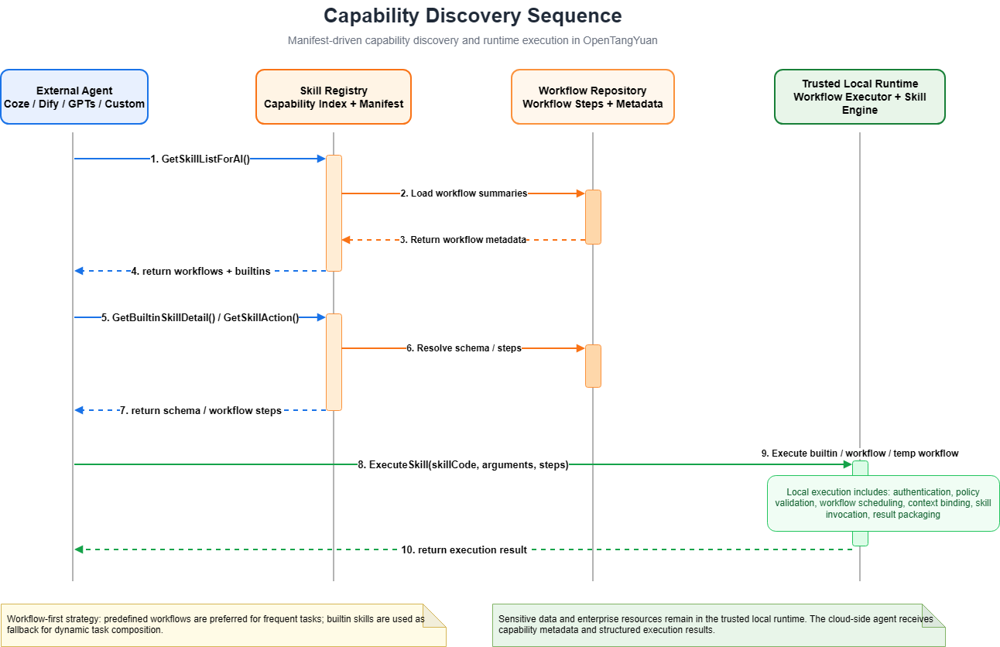
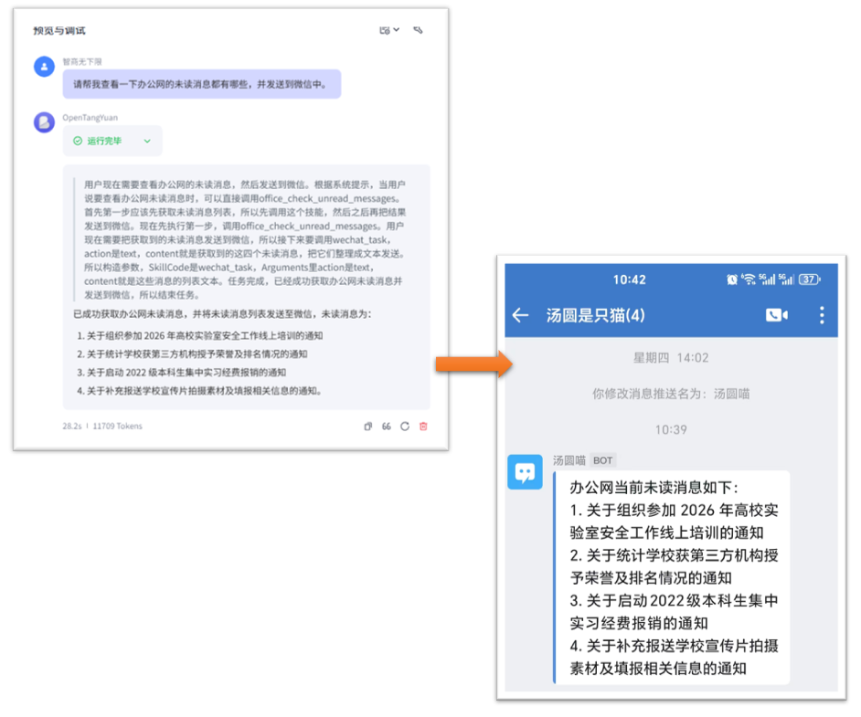
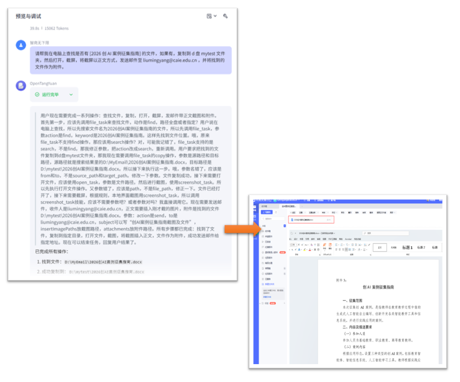
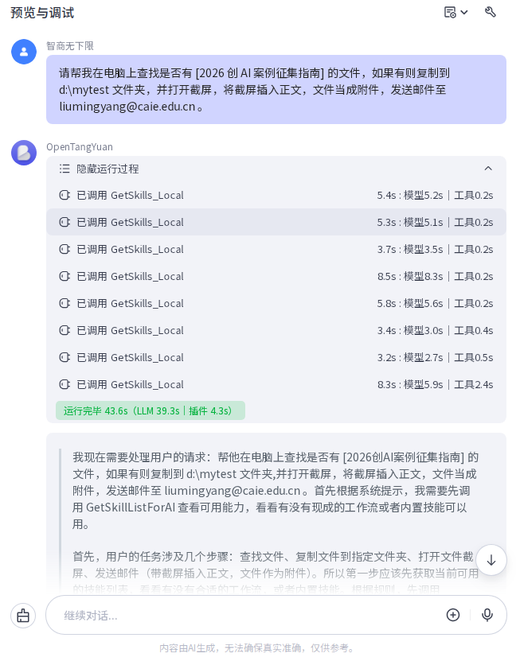
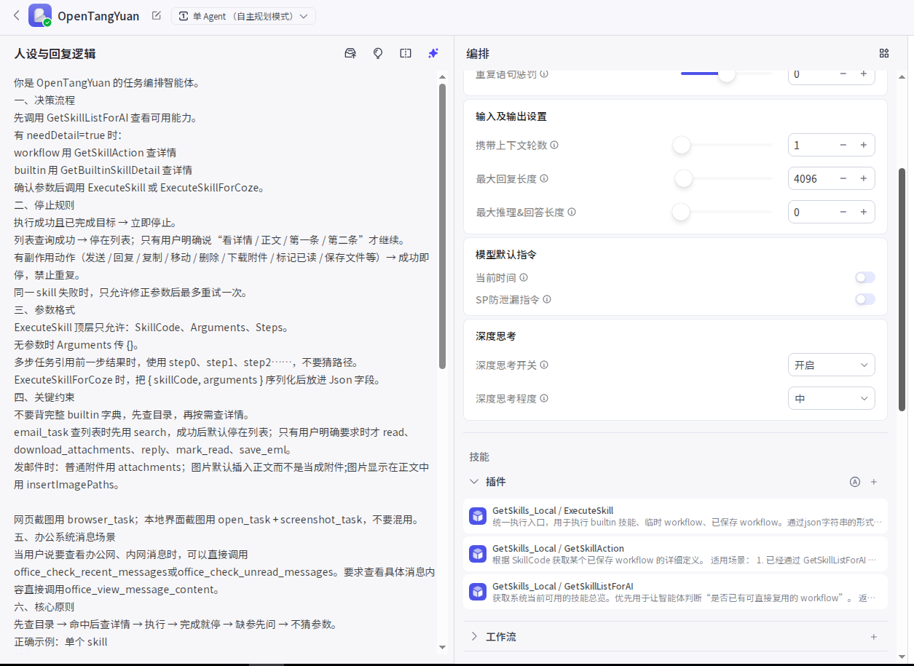

[English](readme_En.md)

# OpenTangYuan

<p align="center">
  <strong>面向隐私敏感型办公自动化的云端—本地智能体工作流运行时</strong>
</p>

<p align="center">
  通过云端规划与可信本地执行，连接浏览器、电子邮件、文件系统、企业通信工具、本地工具及内部业务系统。
</p>

<p align="center">
  <a href="#what-is-opentangyuan">项目简介</a> ·
  <a href="#why-opentangyuan">设计价值</a> ·
  <a href="#system-architecture">系统架构</a> ·
  <a href="#quick-start">快速开始</a> ·
  <a href="#workflow-runtime">工作流运行时</a> ·
  <a href="#core-apis">核心 API</a> ·
  <a href="#security-and-deployment-boundaries">安全边界</a> ·
  <a href="#platform-and-reproducibility">平台与复现</a>
</p>

<p align="center">
  <a href="#"></a>
  <a href="LICENSE"></a>
  <a href="#"></a>
  <a href="#"></a>
  <a href="#"></a>
</p>

---

<a id="what-is-opentangyuan"></a>

## OpenTangYuan 是什么？

**OpenTangYuan** 是一个开源的**智能体工作流运行时（Agent Workflow Runtime）**，面向隐私敏感型办公自动化和机构工作流程自动化。

它针对一种常见场景而设计：外部 AI 智能体能够理解用户请求并规划任务，但任务的实际执行往往需要访问本地文件、电子邮件账户、浏览器、屏幕截图、企业通信工具或内部业务系统。这些资源不应直接暴露给云端智能体。

OpenTangYuan 将两侧职责分离：

```text
云端：任务规划与能力元数据
本地运行时：任务执行与敏感数据处理
企业系统：仅通过可信本地运行时访问
```

在实际运行中，智能体可以发现可用的本地能力，按需查询详细信息，组合工作流，并将任务提交给可信运行时。运行时在本地完成实际操作，并返回结构化结果。

OpenTangYuan 本身并不是一个聊天机器人，也不是一个简单的工具调用演示。它是位于外部智能体与本地自动化能力之间的运行时层，使智能体能够安全地使用本地能力，同时让敏感数据和执行权限始终处于本地控制之下。

项目最初的验证场景来源于高校行政办公，但其设计并不依赖特定机构或业务系统。它可以扩展到科研管理、企业后台办公、实验室运行、政务辅助流程以及其他对隐私较为敏感的自动化场景。

---

<a id="why-opentangyuan"></a>

## 为什么需要 OpenTangYuan？

OpenTangYuan 首先是一个开源运行时，同时也是我们 SoftwareX 论文所对应的软件成果。

与典型的工具调用架构相比，OpenTangYuan 增加了一个面向实际应用的运行时层，使基于智能体的办公自动化更安全、更易复用：

1. **基于清单的技能注册机制**  
   每项本地技能都通过结构化的 `skill-manifest.json` 描述，其中包括能力、参数、支持的操作、使用示例、约束条件及副作用。智能体可以按需发现和查询技能，无须一次性将全部工具说明加载到上下文中。

2. **基于工作流的多步骤执行**  
   OpenTangYuan 同时支持存储在数据库中的可复用工作流，以及运行时动态生成的临时工作流。多个内置技能可以被编排为可追踪的自动化流程。

3. **可信本地运行时**  
   文件访问、电子邮件、浏览器控制、屏幕截图、本地工具及企业系统交互等敏感操作均保留在可信本地环境中。云端智能体负责理解、规划和参数生成，但不会直接访问私有资源。

4. **云端—本地混合架构**  
   通过将 AI 决策能力与实际执行权限解耦，OpenTangYuan 将敏感数据与权限保留在用户侧，同时允许云端智能体协助进行任务拆解和工作流规划。

5. **受策略控制的副作用操作**  
   会改变系统状态的操作受到明确控制并被记录，包括发送或回复邮件、下载附件、复制、移动或删除文件、打印、启动程序以及调用外部工具。身份认证、白名单、策略检查和执行日志提供了进一步的安全保障。

6. **可复用的能力发现 API**  
   一组精简的 REST 接口支持 OpenTangYuan 与 Coze、Dify、GPTs 或自定义智能体框架集成。同一套 API 模式覆盖技能发现、详情查询、工作流获取和统一执行。

---

## OpenTangYuan 能做什么？

当任务需要跨越多个系统、稳定重复执行，并且需要在私有数据附近运行时，OpenTangYuan 会特别有用。典型场景包括：

- 搜索、复制、移动、重命名、打开或整理本地文件与文件夹；
- 搜索邮件、读取邮件、下载附件、回复或发送邮件，以及在邮件正文中插入屏幕截图；
- 自动操作浏览器以打开页面、提取内容、截取屏幕或下载文件；
- 将结果推送至企业微信、钉钉等企业通信平台；
- 启动白名单内的本地工具或可执行程序；
- 将多个本地技能组合成可复用工作流；
- 通过 Coze、Dify、GPTs 或自定义智能体网关触发本地任务。

简单任务可以只调用一个内置技能，例如搜索邮件。更复杂的任务则可以包含多个步骤，例如：

```text
搜索文件 -> 打开文件 -> 截取屏幕 -> 发送邮件
```

---

<a id="system-architecture"></a>

## 系统架构


OpenTangYuan 采用云端—本地协作模式。

| 层级 | 职责 |
|---|---|
| 用户交互层 | Web、移动端、聊天界面、API、SDK、Coze、Dify、GPTs 和自定义智能体。 |
| OpenTangYuan 编排层 | 工作流仓库、技能注册、能力发现、规划与路由。 |
| 安全执行通道 | 云端编排层与本地运行时之间的安全通信。 |
| 可信本地运行时层 | 身份认证、策略校验、工作流调度、技能调用、上下文管理和结果封装。 |
| 企业集成层 | 浏览器、电子邮件、文件系统、企业微信、本地工具、OA、ERP/CRM 和自定义 API。 |
| 治理与合规 | 隐私保护、访问控制、信任管理、审计、监控与告警。 |

系统有意保持清晰的执行边界：

```text
云端：仅负责规划与能力元数据
本地运行时：负责执行与敏感数据处理
企业系统：仅通过可信本地运行时访问
```

---

<a id="quick-start"></a>

## 快速开始

### 环境要求

完整的桌面自动化功能在 Windows 10、Windows 11 或 Windows Server 2016 及以上版本中运行效果最佳。你需要：

- .NET 8 SDK 或 Runtime；
- Visual Studio 2022、JetBrains Rider 或 `dotnet` CLI；
- SQLite；
- 可选的电子邮件账户、企业微信机器人和本地浏览器环境。

服务端组件也可以在 Linux 或 Docker 中运行。但桌面文件搜索、文档打开、屏幕截图和本地工具调用等功能仍需要 Windows 桌面资源。

### 克隆仓库

```bash
git clone https://github.com/wrnas/OpenTangYuan.git
cd OpenTangYuan
```

也可以从 Gitee 克隆：

```bash
git clone https://gitee.com/l00f/open-tang-yuan.git
cd open-tang-yuan
```

### 恢复依赖

```bash
dotnet restore
```

### 启动服务

```bash
dotnet run --urls "http://localhost:54124"
```

### 验证服务

```bash
curl -X POST http://localhost:54124/api/Skills/GetSkillListForAI
```

正常情况下，你将看到可用工作流和内置技能的列表。

### Swagger / OpenAPI



服务启动后，访问：

```text
http://localhost:54124/swagger
```

可以通过 Swagger 以交互方式浏览和测试 API。

---

## 核心概念

初次接触 OpenTangYuan 时，只需要记住三个概念：技能、工作流和可信本地运行时。其他功能都建立在这三个概念之上。

OpenTangYuan 围绕一个简单原则构建：

> 让 AI 理解并规划任务，同时将实际执行和敏感数据保留在可信本地环境中。

系统中的其他设计均遵循这一原则。

### 1. 技能：一切操作都是能力

OpenTangYuan 中的每项操作都被表示为一个**技能（Skill）**。

技能是一种执行特定任务的可复用能力，例如：

- 搜索或整理本地文件；
- 读取或发送电子邮件；
- 控制浏览器；
- 截取屏幕；
- 发送企业消息；
- 启动经过批准的本地工具。

OpenTangYuan 不会将这些能力直接嵌入 AI 提示词，而是通过统一运行时公开它们，使不同 AI 智能体能够以一致的方式发现和调用这些能力。

---

### 2. 先发现，再执行

外部智能体无须预先知道全部技能及其参数。

OpenTangYuan 采用以下能力发现流程：

```text
GetSkillListForAI
        ↓
GetBuiltinSkillDetail / GetSkillAction
        ↓
ExecuteSkill / ExecuteSkillForCoze
```

这种方式可以保持提示词简洁，减少不必要的上下文占用，并允许在不修改智能体本身的情况下增加新技能。

---

### 3. 使用工作流构建复杂任务

现实任务往往包含多个步骤，而不是一次简单的工具调用。

OpenTangYuan 将独立技能组合成可复用的**工作流（Workflow）**，从而使复杂自动化任务更易于构建和维护。

例如：

```text
搜索文件
    ↓
打开文件
    ↓
截取屏幕
    ↓
发送邮件
```

工作流可以预先存储在数据库中，也可以由 AI 智能体在需要时动态组装为临时工作流。

---

### 4. 上下文在工作流中自动传递

某一步产生的结果会自动提供给后续步骤使用。

通过模板变量可以方便地引用此前的输出：

```text
{{step0}}
{{step0.path}}
{{step0.data.path}}
{{step1.result}}
```

因此，后续步骤能够自然地建立在前一步结果之上，无须手动传递中间值。

---

### 5. 实际执行始终发生在本地

云端智能体负责理解用户请求、选择技能并准备参数。

本地运行时负责执行实际操作，包括：

- 访问文件；
- 操作浏览器；
- 发送电子邮件；
- 截取屏幕；
- 调用本地应用程序；
- 与企业系统通信。

将执行保留在本地，有助于保护敏感数据，同时让 AI 服务专注于推理和规划。

---

### 6. 运行时内置安全机制

发送电子邮件、删除文件、下载附件或启动程序等操作可能产生副作用。

OpenTangYuan 会在执行这些操作前应用内置保护机制，包括：

- API 身份认证；
- 路径白名单；
- 可执行程序白名单；
- 执行日志；
- 策略校验。

这些机制使运行时能够在保持灵活性的同时，适用于需要受控自动化的环境。

---

## 能力发现



外部智能体通过以下流程发现系统能力：

1. 调用 `GetSkillListForAI`，获取可用工作流和内置技能的摘要。
2. 如需更多信息，对内置技能调用 `GetBuiltinSkillDetail`，对工作流调用 `GetSkillAction`。
3. 根据返回的参数规范构造调用。
4. 通过 `ExecuteSkill` 或 `ExecuteSkillForCoze` 提交执行。

### 设计优势

| 机制 | 优势 |
|---|---|
| 首次仅获取摘要 | 减少提示词长度和 token 使用量。 |
| 按需查询详情 | 保持智能体上下文精简。 |
| 优先使用工作流 | 复用已经验证的步骤，提高一致性。 |
| 内置技能作为后备 | 灵活处理临时任务。 |
| 基于清单的设计 | 更便于扩展与维护。 |

---

<a id="workflow-runtime"></a>

## 工作流运行时

OpenTangYuan 内置工作流运行时，可处理预定义工作流和临时多步骤任务。

支持的功能包括：

- 步骤调度；
- 上下文传递；
- 模板变量解析；
- 运行时执行；
- 紧凑结果封装；
- 调试日志；
- 失败报告。

### 执行流程

```text
1. 接收工作流步骤
2. 初始化执行上下文
3. 按顺序执行每个步骤
4. 解析模板变量
5. 调用对应的内置技能
6. 将结果保存为 stepN
7. 允许后续步骤引用此前输出
8. 返回最终结果
```

### 模板变量示例

```text
{{step0}}
{{step0.path}}
{{step0.data.path}}
{{step1.result}}
```

### 工作流示例：截屏并发送邮件

```json
{
  "SkillCode": "temp_task",
  "Arguments": {},
  "Steps": [
    {
      "Action": "screenshot_task",
      "Args": {
        "action": "capture_full_screen"
      }
    },
    {
      "Action": "email_task",
      "Args": {
        "action": "send",
        "to": "someone@example.com",
        "subject": "Screen capture",
        "body": "The automatically captured screenshot is attached below.",
        "insertImagePaths": [
          "{{step0.data.path}}"
        ]
      }
    }
  ]
}
```

### 工作流示例：搜索、打开、截屏并发送邮件

```json
{
  "SkillCode": "temp_task",
  "Arguments": {},
  "Steps": [
    {
      "Action": "file_task",
      "Args": {
        "action": "search",
        "keyword": "target_document",
        "ext": "docx"
      }
    },
    {
      "Action": "open_task",
      "Args": {
        "path": "{{step0.data.firstPath}}"
      }
    },
    {
      "Action": "screenshot_task",
      "Args": {
        "action": "capture_full_screen"
      }
    },
    {
      "Action": "email_task",
      "Args": {
        "action": "send",
        "to": "someone@example.com",
        "subject": "Document screenshot and attachment",
        "body": "The document screenshot is inserted below, and the original file is attached.",
        "insertImagePaths": [
          "{{step2.data.path}}"
        ],
        "attachments": [
          "{{step0.data.firstPath}}"
        ]
      }
    }
  ]
}
```

---

## 演示截图

### 智能体执行示例



这些截图来自中文办公自动化环境。可以在论文或补充材料中添加英文图注或标注，用于解释关键界面元素、工作流步骤和执行结果。运行时 API 与工作流定义本身不依赖自然语言。

### 动态组合任务执行



### Coze 调试轨迹



---

## 内置技能

| SkillCode | 说明 |
|---|---|
| `email_task` | 发送、搜索和读取邮件，下载附件，回复邮件，标记为已读，并保存为 `.eml` 文件。 |
| `wechat_task` | 向企业微信发送文本、Markdown 或卡片消息。 |
| `browser_task` | 浏览网页、截取屏幕、提取内容并下载文件。 |
| `file_task` | 搜索、复制、移动和重命名文件，创建目录并执行批量操作。 |
| `open_task` | 打开本地文件、目录或程序。 |
| `print_task` | 打印本地文件。 |
| `tool_task` | 调用白名单中的本地工具或可执行程序。 |
| `screenshot_task` | 截取全屏或活动窗口。 |
| `folder_task` | 按文件扩展名整理文件。 |
| `lock_task` | 锁定本地工作站。 |

---

<a id="core-apis"></a>

## 核心 API

本 README 列出了智能体集成所需的主要 API。完整参数说明请参见 [`docs/api.md`](docs/api.md)。

| API | 方法 | 端点 | 用途 |
|---|---|---|---|
| GetSkillListForAI | POST | `/api/Skills/GetSkillListForAI` | 获取工作流和内置技能摘要。 |
| GetBuiltinSkillDetail | POST | `/api/Skills/GetBuiltinSkillDetail` | 获取内置技能的详细定义。 |
| GetBuiltinSkillManifest | POST | `/api/Skills/GetBuiltinSkillManifest` | 获取内置技能的完整清单。 |
| GetSkillAction | POST | `/api/Skills/GetSkillAction` | 获取工作流的步骤定义。 |
| ExecuteSkill | POST | `/api/Skills/ExecuteSkill` | 统一执行内置技能、工作流或临时任务。 |
| ExecuteSkillForCoze | POST | `/api/Skills/ExecuteSkillForCoze` | 面向 Coze 的兼容执行封装。 |

### 获取技能列表

```http
POST /api/Skills/GetSkillListForAI
```

示例：

```bash
curl -X POST http://localhost:54124/api/Skills/GetSkillListForAI
```

响应示例：

```json
{
  "success": true,
  "data": {
    "workflows": [
      {
        "skillCode": "capture_and_send_email",
        "AIDesc": "Capture a screenshot and send it by email.",
        "sourceType": "workflow",
        "needDetail": true
      }
    ],
    "builtins": [
      {
        "skillCode": "email_task",
        "AIDesc": "Email operations such as search, read, send, reply and attachment download.",
        "sourceType": "builtin",
        "needDetail": true
      }
    ]
  }
}
```

### 获取内置技能详情

```http
POST /api/Skills/GetBuiltinSkillDetail
```

请求体：

```json
{
  "skillCode": "email_task"
}
```

### 获取工作流定义

```http
POST /api/Skills/GetSkillAction
```

请求体：

```json
{
  "skillCode": "capture_and_send_email"
}
```

### 执行技能

```http
POST /api/Skills/ExecuteSkill
```

请求字段：

| 字段 | 类型 | 必填 | 说明 |
|---|---|---|---|
| `SkillCode` | string | 是 | 技能标识，例如 `email_task` 或 `temp_task`。 |
| `Arguments` | object | 否 | 单步骤任务的参数。 |
| `Steps` | array | 否 | 临时工作流的步骤。 |

### Coze 兼容执行接口

```http
POST /api/Skills/ExecuteSkillForCoze
```

请求体：

```json
{
  "Json": "{\"skillCode\":\"email_task\",\"arguments\":{\"action\":\"search\",\"subjectKeyword\":\"notification\",\"maxCount\":10}}"
}
```

### 响应格式

成功：

```json
{
  "success": true,
  "message": "Execution succeeded.",
  "data": {}
}
```

失败：

```json
{
  "success": false,
  "message": "Invalid arguments.",
  "errorCode": "INVALID_ARGUMENTS",
  "data": null
}
```

---

## 配置

请勿将电子邮件密码、授权码、Webhook 密钥、API Token、数据库密钥或内部系统凭据提交到仓库。建议使用环境变量、用户机密、Docker Secrets、CI/CD 变量或独立的生产配置文件。

### 邮件设置示例

```json
{
  "EmailSettings": {
    "SmtpServer": "smtp.example.com",
    "SmtpPort": 465,
    "SmtpUseSsl": true,
    "SenderEmail": "your-email@example.com",
    "SenderPassword": "your-authorization-code",
    "ImapServer": "imap.example.com",
    "ImapPort": 993,
    "ImapUseSsl": true
  }
}
```

### 文件访问白名单示例

```json
{
  "FileSystem": {
    "AllowedRoots": [
      "C:\\Users\\Public\\Documents",
      "D:\\Work",
      "D:\\Temp"
    ]
  }
}
```

### 可执行程序白名单示例

```json
{
  "AllowedExeNames": [
    "pandoc.exe",
    "custom-tool.exe"
  ]
}
```

### 配置项说明

| 配置键 | 是否必需 | 说明 |
|---|---|---|
| `EmailSettings:SmtpServer` | 可选 | SMTP 服务器地址。 |
| `EmailSettings:SmtpPort` | 可选 | SMTP 端口。 |
| `EmailSettings:SenderEmail` | 可选 | 发件人邮箱地址。 |
| `EmailSettings:SenderPassword` | 可选 | 邮箱授权码。 |
| `EmailSettings:ImapServer` | 可选 | IMAP 服务器地址。 |
| `ConnectionStrings:Sqlite` | 是 | SQLite 连接字符串。 |
| `FileSystem:AllowedRoots` | 推荐 | 运行时可访问的目录。 |
| `AllowedExeNames` | 推荐 | 允许启动的可执行程序。 |
| `DebugMode` | 可选 | 启用详细调试日志。 |

---

## 外部智能体集成

OpenTangYuan 可以作为 Coze、Dify、GPTs 或自定义智能体平台的外部执行运行时。外部智能体负责理解用户意图、选择技能和构造参数，本地运行时负责完成实际执行。

建议采用以下方式将 OpenTangYuan 与外部智能体集成：

### 1. 为智能体创建插件

建议创建 **4 个插件**，分别对应 OpenTangYuan 的核心 API：

| 插件名称 | 端点 | 说明 |
|---|---|---|
| GetSkillListForAI | `Skills/GetSkillListForAI` | 获取当前可用技能的概览。应首先调用该接口，让智能体判断是否已经存在可复用工作流。返回两类能力：（1）`workflows`：数据库中预先保存的工作流，应优先直接使用；（2）`builtins`：`browser_task`、`file_task`、`tool_task`、`email_task` 和 `wechat_task` 等原子内置技能。**使用规则：**（a）收到用户请求后始终先调用该工具；（b）如果找到合适的工作流，继续通过 `GetSkillAction` 查看详情，再调用 `ExecuteSkill`；（c）如果没有合适工作流，可使用带 `Steps` 的 `ExecuteSkill` 组合临时工作流，或调用 `AiBrowser` 进行底层浏览器自动化。 |
| GetSkillAction | `Skills/GetSkillAction` | 根据 `SkillCode` 获取已保存工作流的完整定义。**适用场景：**（a）通过 `GetSkillListForAI` 找到可能适用的工作流；（b）需要查看其用途、步骤和参数；（c）执行前需要确认其是否适合当前任务。**输入规则：**只传递 `SkillCode`，并且该值必须来自 `GetSkillListForAI` 返回的 `workflows` 列表。输出包括 `skillCode`、`remark`、`skillType`、`updateTime`、`steps` 和 `skillActionsRaw`。**建议：**在决定是否调用 `ExecuteSkill` 前始终先读取详情，不要跳过该步骤而盲目执行工作流。 |
| ExecuteSkill | `Skills/ExecuteSkillForCoze` | 内置技能、临时工作流和已保存工作流的统一执行入口。参数以 JSON 字符串形式传递。 |
| GetBuiltinSkillDetail | `Skills/GetBuiltinSkillDetail` | 获取内置技能的详细信息，包括用途、参数和示例。 |

### 2. 设置系统提示词

以 Coze 为例，系统提示词较长，完整版本见：

➡️ **[`doc/docs/agent-prompt.md`](doc/docs/agent-prompt.md)**

### 3. 核心调用流程

1. 调用 `GetSkillListForAI` 查看可用能力。
2. 如果 `needDetail` 为 `true`，继续获取详情：
   - 工作流：`GetSkillAction`
   - 内置技能：`GetBuiltinSkillDetail`
3. 确认参数后，调用 `ExecuteSkill` 或 `ExecuteSkillForCoze`。
4. 执行成功后立即停止，**不要重复执行具有副作用的操作**。
5. 如果返回列表，应展示列表并**停止**。仅当用户明确要求查看详情，例如“读取第一条”时，才继续操作。
6. 如果缺少必填参数，应向用户询问。**不得猜测**路径、邮箱地址、文件名或凭据。
7. 如果技能执行失败，可以在修正参数后**重试一次**。

### Coze 智能体配置示例



---

<a id="security-and-deployment-boundaries"></a>

## 安全与部署边界

OpenTangYuan 能够发送电子邮件、修改文件、控制浏览器、截取屏幕、打印以及运行本地可执行程序，因此应当在具有适当访问控制的可信环境中运行。

### 云端—本地边界

| 组件 | 角色 |
|---|---|
| 外部智能体 | 任务理解、工作流规划与技能路由。 |
| 可信本地运行时 | 执行、身份认证、策略校验、上下文管理与结果封装。 |
| 企业系统 | 仅由本地运行时访问，不直接暴露给云端智能体。 |

### 安全建议

- 不要将密码、Token 和 Webhook 密钥等机密信息提交到仓库。
- 在生产环境中限制 API 访问，例如使用 IP 白名单或 VPN。
- 避免将本地运行时直接暴露在公网。
- 对所有具有副作用的操作启用审计日志，包括发送邮件、删除文件和打印。
- 对高风险操作增加人工确认或审批。
- 使用路径白名单限制文件系统访问范围。
- 使用可执行程序白名单限制可以启动的程序。
- 定期轮换邮箱授权码、Webhook 密钥和 API Token。
- 对内部系统端点设置白名单并记录访问尝试。
- 保留执行日志，以便故障排查和合规审计。

---

## 生产环境重要说明

在生产环境中，建议采取以下措施：

- 启用 HTTPS，确保数据传输安全。
- 禁用 Swagger UI，或为 Swagger 启用用户身份认证（相关配置项位于 `appsettings.json`）。
- 在 `Program.cs` 中找到启用 Swagger 用户认证的代码段，并取消相应注释。
- 在控制器上添加 `[Authorize(AuthenticationSchemes = "ApiKey")]` 以启用 API Key 校验。例如：

```csharp
    [Authorize(AuthenticationSchemes = "ApiKey")]
    [Route("api/[controller]")]
    [ApiController]
    public class SkillsController : BaseCommandController
    {
        // ...
    }
```

---

<a id="platform-and-reproducibility"></a>

## 平台与可复现性

完整桌面自动化以 Windows 为主要运行平台，因为文件搜索、文档打开、屏幕截图和本地工具调用依赖 Windows 桌面资源。

为了便于评估，OpenTangYuan 提供了多种验证路径：

| 验证方式 | 平台 | 可验证内容 |
|---|---|---|
| 浏览源代码和文档 | 任意平台 | 系统架构、API 设计、工作流模型和安全设计。 |
| 启动服务并使用 Swagger | Windows / Linux / Docker | API 端点和能力发现。 |
| Windows 独立发布包 | Windows | 无须安装 .NET 8 即可运行本地运行时。 |
| 完整外部智能体集成 | Windows 运行时 + 智能体平台 | 与 Coze、Dify、GPTs 或自定义智能体进行端到端自动化。 |

真实试点日志可能包含电子邮件正文、文件路径、屏幕截图和内部系统数据等敏感信息，因此不会公开。项目提供源代码、文档、示例工作流和部署指南，用于复现软件结构和执行路径。

---

## Docker 部署

Docker 适合用于运行服务端组件和检查 API。屏幕截图、打开文档和 Windows 文件搜索等高度依赖桌面的功能，仍然需要具有桌面访问能力的 Windows 运行时。

### 构建镜像

```bash
docker build -t opentangyuan .
```

### 运行容器

```bash
docker run -d \
  --name opentangyuan \
  -p 54124:54124 \
  opentangyuan
```

### `docker-compose.yml` 示例

```yaml
version: '3.8'

services:
  tangyuan-app:
    build: .
    container_name: tangyuan-app
    restart: always
    ports:
      - "54124:54124"
    volumes:
      - ./sqlite-data:/app/data
    environment:
      - TZ=Asia/Shanghai
      - ASPNETCORE_URLS=http://*:54124
```

---

## 技术栈

| 技术 | 用途 |
|---|---|
| .NET 8 | 后端框架。 |
| C# 10+ | 主要实现语言。 |
| ASP.NET WebAPI | 本地运行时 API。 |
| SQLite | 工作流存储。 |
| Dapper | 数据访问。 |
| MailKit | SMTP / IMAP 邮件处理。 |
| Playwright | 浏览器自动化。 |
| Everything SDK / Windows Search | Windows 文件搜索。 |
| WeChat Work Webhook / API | 企业消息通信。 |
| REST API | 技能查询与执行接口。 |
| JSON Manifest | 技能元数据描述。 |
| Docker | 可选的容器化部署。 |

---

## 扩展机制

OpenTangYuan 可以通过以下方式扩展：

1. **添加新的内置技能**  
   在 WebAPI 中实现逻辑，并将其注册到 `skill-manifest.json`。

2. **添加新的工作流**  
   将工作流存储到数据库中，或通过管理 API 将多个内置技能组合成可复用流程。

3. **集成新的企业系统**  
   使用浏览器自动化、REST API、本地工具或自定义插件连接 OA、ERP、CRM、文件服务器、邮件服务器及其他系统。

4. **扩展安全策略**  
   增加路径白名单、API 访问控制、基于角色的权限、审批工作流、审计日志或告警规则。

---

## 开发与贡献

欢迎提交 Issue 和 Pull Request。推荐的开发环境包括：

- Visual Studio 2022；
- JetBrains Rider；
- VS Code + C# Dev Kit；
- `dotnet` CLI。

常用依赖：

```bash
dotnet add package MailKit
dotnet add package Microsoft.Playwright
dotnet add package Microsoft.Data.Sqlite
dotnet add package Dapper
```

提交信息格式：

```text
<type>: <subject>
```

示例：

```text
feat: add enterprise message notification
fix: handle missing email attachment path
docs: update workflow examples
```

---

## 常见问题

### 为什么无法发送邮件？

请检查 SMTP 配置、SSL 设置、授权码、邮箱服务商是否允许 SMTP，以及当前网络连接。

### 为什么无法读取邮件？

请检查 IMAP 配置、授权码、是否已启用 IMAP，以及邮箱服务商是否对第三方客户端设置了限制。

### 为什么无法打开或打印文件？

请确认文件存在，运行时具有访问权限，系统已为该文件类型安装默认应用程序，并且文件路径位于 `AllowedRoots` 范围内。

### 为什么浏览器任务执行失败？

请确认 Playwright 已完整安装，目标页面不要求登录，选择器正确，并且任务没有被验证码或多因素认证阻止。

### 为什么后续步骤无法引用前一步结果？

请检查步骤编号，例如 `step0` 和 `step1`；检查字段路径是否准确，例如 `{{step0.data.path}}`；并确认前一步执行成功。不要猜测路径，应使用实际返回的数据结构。

---

## 路线图

- 可视化工作流设计器；
- Web 管理后台；
- 基于插件的技能扩展；
- 权限管理与操作审计；
- 改进 Docker Compose 配置；
- 带 CI/CD 的 GitHub Release；
- Zenodo DOI；
- MCP 支持；
- 更多办公软件自动化能力；
- 自动化测试套件和基准测试任务；
- 分布式运行时节点管理。

---

## 许可证

本项目采用 MIT License。详情请参见 [LICENSE](LICENSE)。

---

## 致谢

感谢所有为 OpenTangYuan 的设计、开发、测试和反馈做出贡献的人。
