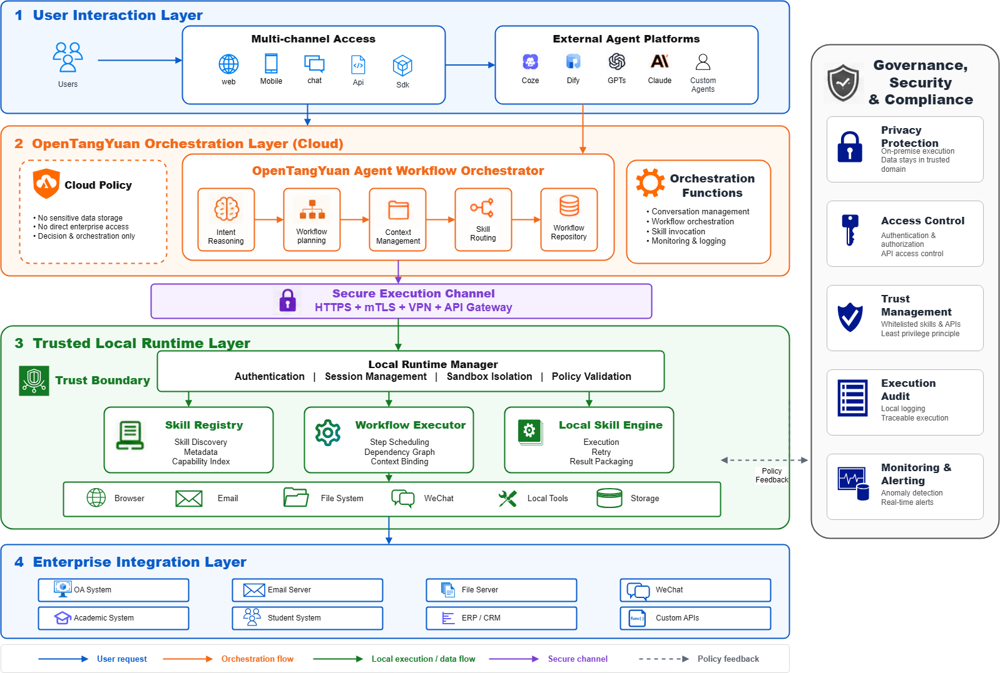

[中文版](README_zh-CN.md)

# OpenTangYuan

<p align="center">
  <strong>Cloud-Planned, Locally Executed Agent Workflow Runtime for Privacy-Sensitive Office Automation</strong>
</p>

<p align="center">
  Connect browsers, email, file systems, enterprise messaging, local tools, and internal systems through cloud-side task understanding and planning with trusted local execution.
</p>

<p align="center">
  <a href="#overview">Overview</a> ·
  <a href="#why-opentangyuan">Design Highlights</a> ·
  <a href="#system-architecture">Architecture</a> ·
  <a href="#quick-start">Quick Start</a> ·
  <a href="#workflow-example">Workflow Example</a> ·
  <a href="#documentation">Documentation</a> ·
  <a href="#security-and-platform-boundaries">Security Boundaries</a>
</p>

<p align="center">
  
  <a href="LICENSE"></a>
  
  
</p>

---

## Overview

**OpenTangYuan** is an open-source **Agent Workflow Runtime** for office automation scenarios that require access to local files, email, browsers, desktop applications, enterprise messaging platforms, or internal systems.

Many external AI agents can understand user intent and plan tasks, but real execution often requires access to sensitive data or local operating privileges. OpenTangYuan separates these responsibilities:

```text
Cloud-side or external agent: understand intent, discover capabilities,
                              plan tasks, and generate parameters
Trusted local runtime:       validate requests, execute skills,
                              manage workflow context, and return structured results
Local and enterprise assets: accessed only by the trusted local runtime
```

An external agent can query the capabilities available in the local environment, retrieve skill or workflow parameter definitions, compose single-step or multi-step jobs, and submit them to the local runtime. Sensitive data and execution privileges remain in an environment controlled by the user.

OpenTangYuan is not a chatbot and is not tied to one agent platform. It provides an execution layer that can be called by Coze, Dify, GPTs, a custom agent gateway, or an ordinary desktop client.

---

## Why OpenTangYuan?

OpenTangYuan focuses on capability discovery, multi-step execution, context propagation, and local permission control in real automation environments.

1. **Manifest-driven skill registration**  
   Local skills are described through structured manifests that define capabilities, parameters, actions, constraints, and side effects. Agents can retrieve summaries first and query detailed definitions only when needed, instead of loading every tool description at once.

2. **Reusable and temporary workflows**  
   The runtime can execute workflows stored in a database as well as temporary multi-step jobs generated dynamically by an agent or client.

3. **Trusted local execution**  
   File, email, browser, screenshot, local application, and enterprise-system operations are performed inside the local runtime. External agents do not access these resources directly.

4. **Workflow context propagation**  
   Each step result is stored in the execution context. Later steps can reference earlier outputs through template variables such as `{{step0.data.path}}`.

5. **Controlled side effects**  
   File changes, email delivery, printing, and program execution can be restricted through path allowlists, executable allowlists, authentication, policy validation, and execution logs.

6. **Unified discovery and execution APIs**  
   A stable set of REST APIs supports skill discovery, detail lookup, workflow retrieval, and unified execution across different agents and clients.

---

## Key Capabilities

OpenTangYuan is intended for tasks that span multiple local or enterprise systems, including:

- searching, copying, moving, renaming, opening, and organizing local files;
- searching, reading, replying to, and sending email, including downloading attachments or embedding screenshots in message bodies;
- opening web pages, extracting content, taking screenshots, and downloading files;
- sending notifications to enterprise messaging platforms such as WeChat Work;
- launching allowlisted local tools or applications;
- combining built-in skills into reusable workflows;
- accepting tasks from external agents, desktop clients, or custom gateways.

A representative multi-step task is:

```text
Search for a file → open it → capture the screen → send the screenshot and file by email
```

---

## System Architecture



OpenTangYuan uses a collaborative architecture between an external agent and a trusted local runtime:

| Layer | Primary responsibility |
|---|---|
| User and Agent Layer | Web, mobile, chat interfaces, Coze, Dify, GPTs, custom agents, and desktop clients. |
| Capability Discovery and Orchestration Layer | Workflow catalog, skill manifests, capability queries, parameter generation, and routing. |
| Trusted Local Runtime | Request validation, policy checks, workflow scheduling, skill invocation, context management, and result packaging. |
| Local and Enterprise Integration Layer | Browsers, email, file systems, enterprise messaging, local programs, OA, ERP/CRM, and custom APIs. |
| Governance and Operations | Access control, logging, auditing, monitoring, alerting, and sensitive configuration management. |

For a detailed design description, see [Architecture and Runtime Model](docs/architecture.md).

---

## Quick Start

### Requirements

Full desktop automation is best run on Windows 10, Windows 11, or Windows Server 2016 and later.

Basic requirements:

- .NET 8 SDK or Runtime;
- Visual Studio 2022, JetBrains Rider, VS Code, or the `dotnet` CLI;
- SQLite;
- optional email, enterprise messaging webhook, browser, and local tool configuration.

The server-side API can run on Linux or in Docker, but desktop file search, document opening, screenshots, and local application invocation still require a Windows environment with desktop access.

### Clone the repository

```bash
git clone https://github.com/wrnas/OpenTangYuan.git
cd OpenTangYuan
```

### Restore and build

```bash
dotnet restore TangYuan.sln
dotnet build TangYuan.sln
```

### Start the runtime

The application source is located under `src/OpenTangYuan/`. From the repository root, run:

```bash
dotnet run --project src/OpenTangYuan --urls "http://localhost:54124"
```

### Verify the service

```bash
curl -X POST http://localhost:54124/api/Skills/GetSkillListForAI
```

A successful response contains summaries of the workflows and built-in skills available in the current installation.

### Swagger / OpenAPI

After the service starts, open:

```text
http://localhost:54124/swagger
```


Before configuring email, file access, or local executable allowlists, read [Configuration and Security Controls](docs/configuration-security.md).

---

## Core Concepts

### Skill

Each executable operation is represented as a skill, such as `email_task`, `file_task`, `browser_task`, or `screenshot_task`. Skills are exposed through a unified interface so that different agents and clients can invoke them consistently.

### Discover Before Executing

Agents do not need to memorize every skill and parameter in advance. The recommended call sequence is:

```text
GetSkillListForAI
        ↓
GetBuiltinSkillDetail / GetSkillAction
        ↓
ExecuteSkill / ExecuteSkillForCoze
```

### Workflow

Multiple skills can be composed into a workflow. OpenTangYuan supports:

- reusable workflows stored in a database;
- temporary multi-step workflows supplied in a request;
- direct execution of a single built-in skill.

### Context Variables

Each step result is stored as a context object such as `step0`, `step1`, or `step2`. Later steps can reference values through expressions such as:

```text
{{step0}}
{{step0.path}}
{{step0.data.path}}
{{step0.data.firstPath}}
{{step1.result}}
```

The field path must match the actual response structure returned by the previous step.

---

## Workflow Example

The following temporary workflow searches for a file, opens it, captures the screen, embeds the screenshot in an email, and attaches the original file:

```json
{
  "SkillCode": "temp_task",
  "Arguments": {},
  "Steps": [
    {
      "Action": "file_task",
      "Args": {
        "action": "search",
        "keyword": "target_document",
        "ext": "docx"
      }
    },
    {
      "Action": "open_task",
      "Args": {
        "path": "{{step0.data.firstPath}}"
      }
    },
    {
      "Action": "screenshot_task",
      "Args": {
        "action": "capture_full_screen"
      }
    },
    {
      "Action": "email_task",
      "Args": {
        "action": "send",
        "to": "someone@example.com",
        "subject": "Document Screenshot and Attachment",
        "body": "The automatically captured screenshot is shown below. The original file is attached.",
        "insertImagePaths": [
          "{{step2.data.path}}"
        ],
        "attachments": [
          "{{step0.data.firstPath}}"
        ]
      }
    }
  ]
}
```

For execution modes, response structures, and error handling, see the [Core API Reference](docs/api.md) and [Built-in Skills Reference](docs/builtin-skills.md).

---

## WinForms Reference Client

An independent WinForms reference client can be placed under `samples/OpenTangYuan.WinFormsDemo/` to demonstrate how a standard desktop application can call OpenTangYuan through its REST APIs without depending on a specific agent platform.

The client should connect to a running OpenTangYuan instance before performing capability discovery, parameter lookup, and task execution. See [WinForms Reference Client](samples/OpenTangYuan.WinFormsDemo/README.md) for usage instructions.

---

## Built-in Skills

| SkillCode | Description |
|---|---|
| `email_task` | Search, read, send, and reply to email; download attachments, mark messages as read, and save `.eml` files. |
| `wechat_task` | Send text, Markdown, or card messages to WeChat Work. |
| `browser_task` | Open pages, run browser actions, extract content, take screenshots, and download files. |
| `file_task` | Search, copy, move, and rename files; create directories and run batch operations. |
| `open_task` | Open local files, directories, or applications. |
| `print_task` | Print local files. |
| `tool_task` | Invoke allowlisted local tools or executables. |
| `screenshot_task` | Capture the full screen or active window. |
| `folder_task` | Organize files by extension or other rules. |
| `lock_task` | Lock the local workstation. |

---

## Documentation

- [Documentation Index](docs/README.md)
- [Architecture and Runtime Model](docs/architecture.md)
- [Core API Reference](docs/api.md)
- [Built-in Skills Reference](docs/builtin-skills.md)
- [Configuration and Security Controls](docs/configuration-security.md)
- [Agent Integration Guide](docs/agent-integration.md)
- [Coze System Prompt](docs/coze-system-prompt.md)
- [Deployment and Platform Support](docs/deployment-platform.md)
- [Troubleshooting](docs/troubleshooting.md)
- [WinForms Reference Client](samples/OpenTangYuan.WinFormsDemo/README.md)

---

## Security and Platform Boundaries

OpenTangYuan can send email, modify files, control browsers, capture screenshots, print documents, and launch local programs. It should therefore run only in a trusted environment.

At minimum, deployments should follow these principles:

- do not expose the runtime directly to the public internet;
- do not commit email authorization codes, webhook keys, API tokens, or internal-system credentials;
- use path allowlists to restrict file-system access;
- use executable allowlists to restrict which programs can be launched;
- retain logs for side-effect operations such as sending email, deleting or moving files, and printing;
- add human confirmation or approval for high-risk actions;
- validate parameters generated by external agents and do not trust unchecked paths or commands;
- never repeat a side-effect operation after it has completed successfully.

See [Configuration and Security Controls](docs/configuration-security.md) for the full guidance.

---

## Technology Stack

- .NET 8 / C#;
- ASP.NET Web API;
- SQLite / Dapper;
- MailKit;
- Playwright;
- Everything SDK or Windows Search;
- REST API / JSON manifests;
- optional Docker deployment.

---

## Contributing

Issues and pull requests are welcome. Before submitting changes:

1. confirm that the solution builds with `dotnet build TangYuan.sln`;
2. do not commit real credentials, internal addresses, private email, runtime logs, or sensitive screenshots;
3. document manifests, parameters, and usage examples for new skills;
4. add boundary checks and error handling for operations with side effects;
5. update all related documentation.

---

## License

This project is licensed under the MIT License. See [LICENSE](LICENSE) for details.

---

## Acknowledgements

Thank you to everyone who has contributed to the design, development, testing, and improvement of OpenTangYuan.
