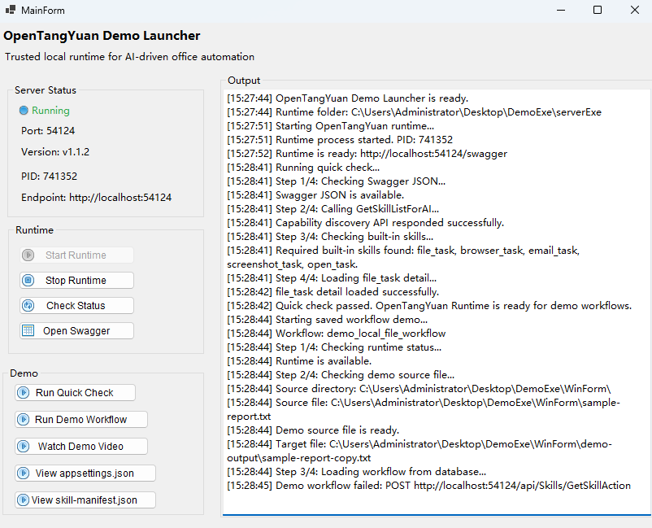

[中文版](README_zh-CN.md)

# OpenTangYuan Local Workflow Demo

This demo shows how **OpenTangYuan Runtime** loads and runs a local workflow stored in the bundled database.

The workflow searches for a sample file, copies it to an output folder, and then opens the copied file.

> [!IMPORTANT]
> **You do not need to install .NET 8.**
>
> The Release package already includes the required .NET Runtime. Extract the entire ZIP file first, then start the demo with `Start-Demo.bat` from the root folder.

## Screenshot



## Demo Scope

This demo runs entirely on the local machine and uses only the bundled sample file and predefined workflow.

It does not require:

- an email account;
- an external AI agent;
- Coze, Dify, or another agent platform;
- enterprise-system credentials;
- access to private user files;
- administrator permissions.

The demo is intended to provide a small, self-contained validation of the Runtime, database workflow loading, step-to-step data passing, and local file operations.

## Quick Start

### Requirements

- Windows 10 or 11 (x64)
- No .NET SDK required
- No .NET Runtime installation required
- Administrator permissions are not required

### How to Run

1. Download the Demo ZIP from the official OpenTangYuan GitHub Releases page.
2. Extract the entire ZIP file to a local folder, for example:

   ```text
   C:\OpenTangYuan-Demo
   ```

3. Double-click the following file in the extracted root folder:

   ```text
   Start-Demo.bat
   ```

4. In the demo window, click the buttons in this order:

   ```text
   Start Runtime
        ↓
   Quick Check
        ↓
   Run Demo
   ```

`Quick Check` verifies that the local Runtime is reachable and that the required demo workflow is available. Continue only after the check reports success.

> [!WARNING]
> Do not start the demo by double-clicking `WinForm\TangYuan.Demo.exe`.
>
> The demo uses the private .NET 8 runtime included in the package. `Start-Demo.bat` sets up the required runtime environment before launching the application.

## What the Demo Does

The workflow used by this demo is already stored in the bundled Runtime database and is loaded with the following `SkillCode`:

```text
demo_local_file_workflow
```

The workflow runs these steps:

```text
Find sample-report.txt
        ↓
Copy it to demo-output
        ↓
Open the copied file
```

This flow verifies that OpenTangYuan can:

- load a saved workflow from the database;
- run a workflow by `SkillCode`;
- pass runtime arguments into the workflow;
- pass data from one workflow step to the next;
- use local file search, copy, and open actions;
- confirm that the output file was actually created.

## Folder Structure

```text
<extracted-folder>
├── Start-Demo.bat       # Demo launcher
├── runtime              # Bundled private .NET runtime
├── serverExe            # OpenTangYuan Runtime, configuration, and bundled database
│   └── TangYuan.exe
└── WinForm              # Desktop demo application and sample file
    ├── TangYuan.Demo.exe
    └── sample-report.txt
```

Keep this folder structure unchanged.

Do not:

- move `TangYuan.Demo.exe` by itself;
- move `TangYuan.exe` by itself;
- delete or move the `runtime`, `serverExe`, or `WinForm` folders;
- run the demo directly from inside the ZIP file;
- delete configuration files, database files, dependency DLLs, `.runtimeconfig.json`, or `.deps.json` files.

## Expected Result

After you click **Run Demo**, the application will:

1. Check that the Runtime is running.
2. Load the predefined workflow from the bundled database.
3. Search for, copy, and open the sample file.
4. Create the following file:

   ```text
   WinForm\demo-output\sample-report-copy.txt
   ```

5. Open the copied file with the default application on your system.

If the copied file is created and opens successfully, the demo has completed as expected.

## Troubleshooting

### The demo does not start

Make sure the ZIP file has been fully extracted, then start the demo with:

```text
Start-Demo.bat
```

Do not run:

```text
WinForm\TangYuan.Demo.exe
```

### Windows displays a security warning

The demo binaries may not be code-signed, so Windows SmartScreen may display a warning the first time the package is launched.

Before continuing, verify that the ZIP file was downloaded from the official OpenTangYuan GitHub Releases page. Do not disable Windows security features globally.

### The Runtime does not start

Check that:

- `serverExe\TangYuan.exe` exists;
- port `54124` is not being used by another application;
- the `serverExe` folder still contains all configuration, database, and dependency files included in the ZIP package.

### Quick Check fails

Check that:

- the Runtime has started successfully;
- port `54124` is reachable locally;
- the bundled database and configuration files have not been moved or deleted;
- the workflow `demo_local_file_workflow` is available.

### sample-report.txt cannot be found

Make sure the file is located at:

```text
WinForm\sample-report.txt
```

### The output file cannot be replaced

Close the previously opened file:

```text
sample-report-copy.txt
```

Then run the demo again.

## More Information

This README only covers how to run the packaged demo.

For the full project overview, architecture, workflow model, API reference, configuration, and source code, visit:

- [OpenTangYuan Repository](https://github.com/wrnas/OpenTangYuan)
- [Main Documentation](https://github.com/wrnas/OpenTangYuan/tree/master/docs)
- [GitHub Releases](https://github.com/wrnas/OpenTangYuan/releases)
